

**Carrera**: Ingeniería de Software

**Periodo**: 2026-20

**Curso**: Aplicaciones Web

**NRC**: 8074

**Profesor**: Alex Humberto Sánchez Ponce

**Informe deL Trabajo Final**

**Startup**: Nexora

**Producto**: PetStock

**Integrantes**:

Mendoza Moreano, Mariel Lucero  - u20231a418

Quispe Palomino, Tony Jhunior - u20241f714

Valladolid Jiménez, Arturo Fernando - u202420147

Mendoza Boluarte, Pierre Alessandro - u202320973

**Agosto, 2026**

# Registro de Versiones del Informe

<table class="c0" style="border-collapse: collapse; width: 100%;">
<tr class="c7">
<td class="c5" style="border: 1px solid black;">Versión</td>
<td class="c5" style="border: 1px solid black;">Fecha</td>
<td class="c5" style="border: 1px solid black;">Autor</td>
<td class="c5" style="border: 1px solid black;">Descripción de modificación</td>
</tr>

<tr class="c7">
<td class="c5" style="border: 1px solid black;">TB1</td>
<td class="c5" style="border: 1px solid black;">24/04/2025</td>
<td class="c5" style="border: 1px solid black;">
Mariel Lucero Mendoza Moreano  
Tony Jhunior Quispe Palomino  
Arturo Fernando Valladolid Jiménez  
Pierre Alessandro Mendoza Boluarte  
I5
</td>
<td class="c5" style="border: 1px solid black;">blablabla</td>
</tr>
</table>

# Project Report Collaboration Insights

A continuación, capturas del procesos, commits  y elaboración de nuestro proyecto en cada entrega.

**Entrega Nº1: TB1**

# Contenido

## Tabla de contenido

### [Capítulo I: Introducción](#capítulo-i-introducción)
- [1.1. Startup Profile](#11-startup-profile)
    - [1.1.1 Descripción de la Startup](#111-descripción-de-la-startup)
    - [1.1.2 Perfiles de integrantes del equipo](#112-perfiles-de-integrantes-del-equipo)
- [1.2 Solution Profile](#12-solution-profile)
    - [1.2.1 Antecedentes y problemática](#121-antecedentes-y-problemática)
    - [1.2.2 Lean UX Process](#122-lean-ux-process)
        - [1.2.2.1. Lean UX Problem Statements](#1221-lean-ux-problem-statements)
        - [1.2.2.2. Lean UX Assumptions](#1222-lean-ux-assumptions)
        - [1.2.2.3. Lean UX Hypothesis Statements](#1223-lean-ux-hypothesis-statements)
        - [1.2.2.4. Lean UX Canvas](#1224-lean-ux-canvas)
- [1.3. Segmentos objetivo](#13-segmentos-objetivo)

### [Capítulo II: Requirements Elicitation & Analysis](#capítulo-ii-requirements-elicitation--analysis)
- [2.1. Competidores](#21-competidores)
    - [2.1.1. Análisis competitivo](#211-análisis-competitivo)
    - [2.1.2. Estrategias y tácticas frente a competidores](#212-estrategias-y-tácticas-frente-a-competidores)
- [2.2. Entrevistas](#22-entrevistas)
    - [2.2.1. Diseño de entrevistas](#211-análisis-competitivo)
    - [2.2.2. Registro de entrevistas](#222-registro-de-entrevistas)
    - [2.2.3. Análisis de entrevistas](#223-análisis-de-entrevistas)
- [2.3. Needfinding](#23-needfinding)
    - [2.3.1. User Personas](#231-user-personas)
    - [2.3.2. User Task Matrix](#232-user-task-matrix)
    - [2.3.3. User Journey Mapping](#233-user-journey-mapping)
    - [2.3.4. Empathy Mapping](#234-empathy-mapping)
- [2.4. Big Picture Event Storming](#24-big-picture-event-storming)
- [2.5. Ubiquitous Language](#25-ubiquitous-language)

### [Capítulo III: Requirements Specification](#capítulo-iii-requirements-specification)
- [3.1. User Stories](#31-user-stories)
- [3.2. Impact Mapping](#32-impact-mapping)
- [3.3. Product Backlog](#33-product-backlog)

### [Capítulo IV: Product Design](#capítulo-iv-product-design)
- [4.1. Style Guidelines](#41-style-guidelines)
    - [4.1.1. General Style Guidelines](#411-general-style-guidelines)
    - [4.1.2. Web Style Guidelines](#412-web-style-guidelines)
- [4.2. Information Architecture](#42-information-architecture)
    - [4.2.1. Organization Systems](#421-organization-systems)
    - [4.2.2. Labeling Systems](#422-labeling-systems)
    - [4.2.3. SEO Tags and Meta Tags](#423-seo-tags-and-meta-tags)
    - [4.2.4. Searching Systems](#424-searching-systems)
    - [4.2.5. Navigation Systems](#425-navigation-systems)
- [4.3. Landing Page UI Design](#43-landing-page-ui-design)
    - [4.3.1. Landing Page Wireframe](#431-landing-page-wireframe)
    - [4.3.2. Landing Page Mock-up](#432-landing-page-mock-up)
- [4.4. Web Applications UX/UI Design](#44-web-applications-uxui-design)
    - [4.4.1. Web Applications Wireframes](#441-web-applications-wireframes)
    - [4.4.2. Web Applications Wireflow Diagrams](#442-web-applications-wireflow-diagrams)
    - [4.4.3. Web Applications Mock-ups](#443-web-applications-mock-ups)
    - [4.4.4. Web Applications User Flow Diagrams](#444-web-applications-user-flow-diagrams)
- [4.5. Web Applications Prototyping](#45-web-applications-prototyping)
- [4.6. Domain-Driven Software Architecture](#46-domain-driven-software-architecture)
    - [4.6.1. Design-Level Event Storming](#461-design-level-event-storming)
    - [4.6.2. Software Architecture Context Diagram](#462-software-architecture-context-diagram)
    - [4.6.3. Software Architecture Container Diagrams](#463-software-architecture-container-diagrams)
    - [4.6.4. Software Architecture Components Diagrams](#464-software-architecture-components-diagrams)
- [4.7. Software Object-Oriented Design](#47-software-object-oriented-design)
    - [4.7.1. Class Diagrams](#471-class-diagrams)
- [4.8. Database Design](#48-database-design)
    - [4.8.1. Database Diagram](#481-database-diagram)

### [Capítulo V: Product Implementation, Validation & Deployment](#capítulo-v-product-implementation-validation--deployment)
- [5.1. Software Configuration Management](#51-software-configuration-management)
    - [5.1.1. Software Development Environment Configuration](#511-software-development-environment-configuration)
    - [5.1.2. Source Code Management](#512-source-code-management)
    - [5.1.3. Source Code Style Guide & Conventions](#513-source-code-style-guide--conventions)
    - [5.1.4. Software Deployment Configuration](#514-software-deployment-configuration)
- [5.2. Landing Page, Services & Applications Implementation](#52-landing-page-services--applications-implementation)
    - [5.2.1. Sprint 1](#521-sprint-1)
        - [5.2.1.1. Sprint Planning 1](#5211-sprint-planning-1)
        - [5.2.1.2. Aspect_Leaders_and_Collaborators](#5212-aspect-leaders-and-collaborators)
        - [5.2.1.3. Sprint Backlog 1](#5213-sprint-backlog-1)
        - [5.2.1.4. Development Evidence for Sprint Review](#5214-development-evidence-for-sprint-review)
        - [5.2.1.5. Execution Evidence for Sprint Review](#5215-execution-evidence-for-sprint-review)
        - [5.2.1.6. Services Documentation Evidence for Sprint Review](#5216-services-documentation-evidence-for-sprint-review)
        - [5.2.1.7. Software Deployment Evidence for Sprint Review](#5217-software-deployment-evidence-for-sprint-review)
        - [5.2.1.8. Team Collaboration Insights during Sprint](#5218-team-collaboration-insights-during-sprint)

### [Conclusion](#conclusiones)

### [Recomendacion](#recomendaciones)

### [Bibliografía](#bibliografia)

### [Anexos](#anexo)

# Student Outcome

Student Outcome ABET: **ABET – EAC - Student Outcome 5**   Criterio: _La capacidad de funcionar efectivamente en un equipo cuyos miembros juntos proporcionan liderazgo, crean un entorno de colaboración e inclusivo, establecen objetivos, planifican tareas y cumplen objetivos._

<table border="1" style="border-collapse: collapse;">
<thead>
<tr>
<th style="width: 20%">Criterio específico</th>
<th style="width: 50%">Acciones realizadas</th>
<th style="width: 30%">Conclusiones</th>
</tr>
</thead>
<tbody>
<tr>
<th>Trabaja en equipo para
proporcionar liderazgo en
forma conjunta</th>
<th>
Mendoza Moreano, Mariel Lucero 
av1: 
blablablabla.
  
Arturo Fernando Valladolid Jiménez 
av1: 
blablablabla  
Mendoza Boluarte , Pierre Alessandro 
av1: 
blablabla
  
Integrante 4 
av1: 
blablablabla  
Integrante 5 
av1: 
blablabla
</th>
<th>
av1: 
blablablabla 
</th>
</tr>
<tr>
<th>Crea un entorno colaborativo e
inclusivo, establece metas,
planifica tareas y cumple
objetivos.</th>
<th>
Mendoza Moreano, Mariel Lucero 
av1: 
blablabla
  
Arturo Fernando Valladolid Jiménez 
av1: 
blablablabla  
Integrante 3 
av1: 
blablabla
  
Integrante 4 
av1: 
blablablabla  
Integrante 5 
av1: 
blablabla
</th>
<th>
av1: 
blablbalbla
</tr>
</tbody>
</table>

# Capítulo I: Introducción

## 1.1. Startup Profile

### 1.1.1 Descripción de la Startup (**Startup: Nexora/Producto: PetStock**)

**Nexora** es una startup tecnológica enfocada en el desarrollo de soluciones de software prácticas y accesibles, diseñadas específicamente para optimizar la gestión y digitalización de los pequeños comercios en el Perú. Surge ante la necesidad de ofrecer herramientas eficientes que permitan a los negocios locales superar las limitaciones de los métodos tradicionales de administración, reduciendo errores y ahorrando tiempo en sus operaciones cotidianas.
Su producto principal, **PetStock**, es una aplicación web intuitiva desarrollada para centralizar la administración de las pequeñas tiendas de mascotas. La plataforma permite a los dueños y administradores registrar y organizar su catálogo de productos, controlar en tiempo real las cantidades disponibles en el inventario, registrar ventas y compras, gestionar información de clientes y proveedores, y recibir alertas automáticas ante un bajo nivel de stock. Mediante una interfaz moderna y adaptada a la realidad del comercio minorista, PetStock ayuda a los negocios a mantener un control preciso de su mercadería y tomar mejores decisiones operativas.

**Misión**: Ayudar a las pequeñas tiendas de mascotas a gestionar de manera eficiente y organizada sus productos, inventario, ventas y compras mediante PetStock, brindándoles una herramienta accesible e intuitiva que simplifique sus operaciones diarias y facilite la toma de decisiones.

**Visión**: Ser una solución tecnológica referente para la gestión de pequeñas tiendas de mascotas en el Perú, contribuyendo a su crecimiento y transformación digital mediante PetStock y futuras soluciones adaptadas a las necesidades del sector. 

### 1.1.2. Perfiles de integrantes del equipo

| Foto | Integrante |
| :---: | :--- |
|  | **Quispe Palomino, Tony Jhunior** — Código de Estudiante: u20241f714. Soy estudiante de la carrera de Ingeniería de Software y actualmente me encuentro cursando el quinto ciclo. Tengo 20 años y me considero una persona amable, empática, perseverante y capaz de adaptarme a los cambios. En cuanto a mis conocimientos de programación, tengo una base sólida en C++, Python y conceptos básicos en HTML, CSS y un poco de JavaScript. En este proyecto, espero poder contribuir con mis conocimientos y habilidades, al mismo tiempo que fortalezco mis competencias en trabajo en equipo y en la creación de aplicaciones web. |
|  | **Valladolid Jiménez, Arturo Fernando** — Código de Estudiante: u202420147. Soy estudiante de la carrera de Ingeniería de Software y actualmente me encuentro cursando el quinto ciclo. Me considero una persona organizada, responsable, comunicativa y enfocada en el trabajo colaborativo. Cuento con conocimientos en HTML, CSS y C++, además de bases sólidas para el análisis, diseño de software y gestión de bases de datos. Mis experiencias previas me han ayudado a desarrollar habilidades comunicativas y de organización, lo cual facilita la coordinación del equipo.  |
| *(Pendiente)* | *[Nombre del integrante 3 — Código de Estudiante]* |
| *(Pendiente)* | *[Nombre del integrante 4 — Código de Estudiante]* |
| *(Pendiente)* | *[Nombre del integrante 5 — Código de Estudiante]* |

## 1.2 Solution Profile

### 1.2.1 Antecedentes y problemática

Para entender el contexto de PetStock, investigamos cómo se está comportando el mercado de mascotas en nuestro país y notamos que está creciendo de manera acelerada. Según los datos de la ENAHO, entre los años 2023 y 2024, el porcentaje de gasto que destinan las familias peruanas a la alimentación de sus mascotas subió del 42,4 % al 49,1 %. Además, revisando la ENAPRES 2024, encontramos que el 51,7 % de los hogares ya cuenta con al menos un perro, resaltando que en los hogares de menores ingresos este número llega hasta el 52,9 %. A la par de esta demanda masiva, hay reportes que indican que el mercado también se ha diversificado, impulsando una mayor oferta de productos premium, artículos de higiene, camas y servicios más especializados. 

A pesar de que el mercado es gigante y sigue en expansión, detectamos que los dueños y administradores de las pequeñas tiendas de mascotas sufren bastantes dolores de cabeza en su operación diaria. El problema central es que tienen muchas dificultades para gestionar de manera eficiente su inventario y sus ventas. Esto pasa porque la mayoría sigue usando métodos manuales, como cuadernos, o herramientas digitales muy genéricas que no están conectadas entre sí. Al no tener un sistema unificado, los dueños se desordenan con la mercadería, no reciben alertas cuando se les está por acabar un producto y terminan sufriendo quiebres de stock. Al final, este desorden administrativo les hace perder ventas directas, reduce sus ganancias y afecta la atención que le dan a sus clientes. 

**Tabla de 5W's y 2H's**
| Pregunta | Formulación | Respuesta |
| :--- | :--- | :--- |
| **Who?** | ¿Quiénes son los afectados? | Dueños y administradores de pequeñas tiendas de mascotas. |
| **What?** | ¿Cuál es el problema? | Dificultades para gestionar eficientemente su inventario y ventas debido al uso de herramientas digitales genéricas o métodos manuales que no se integran entre sí. |
| **Where?** | ¿Dónde ocurre? | Principalmente en tiendas ubicadas en zonas urbanas, residenciales y comerciales de Lima y otras ciudades del Perú. |
| **When?** | ¿Cuándo se hace la evidencia? | Durante la operación diaria, especialmente al atender clientes, registrar ventas o al intentar cuadrar la información del sistema con el almacén físico al final del día. |
| **Why?** | ¿Por qué ocurre? | Debido a que muchas pequeñas tiendas utilizan registros manuales, hojas de cálculo o herramientas que no están integradas, dificultando la actualización automática del inventario y el seguimiento de las ventas y compras. |
| **How?** | ¿Cómo se manifiesta? | Mediante dificultades para controlar las ventas, registrar correctamente las entradas y salidas de productos y mantener actualizado el inventario. |
| **How Much?** | ¿Cuál es la magnitud? | En 2025 se registraron 17,26 millones de mascotas en los hogares peruanos y el 64 % de los hogares tenía al menos una mascota. Además, el mercado de productos y servicios para mascotas se estimó en alrededor de mil millones. |

### 1.2.2 Lean UX Process

#### 1.2.2.1. Lean UX Problem Statements

El estado actual de la gestión comercial en pequeñas tiendas de mascotas se concentra en dueños y administradores que venden alimentos de consumo frecuente o productos de cuidado especial. Muchos aún dependen de cuadernos escritos a mano, notas en papel desconectadas entre sí o tablas genéricas de Excel para controlar las ventas diarias, el inventario y los pedidos a proveedores.

Los productos y servicios actuales no resuelven la necesidad de una plataforma web accesible y ligera, pensada para la operación diaria de una tienda de mascotas. Se requiere un sistema que unifique el control de inventario con alertas de stock mínimo en tiempo real, el registro de ventas y compras, y el seguimiento de clientes, sin exigir capacitaciones técnicas complejas ni configuraciones pesadas.

PetStock buscará cubrir esta brecha mediante una aplicación web intuitiva. La plataforma centralizará en un mismo panel el catálogo de productos, el control de existencias en tiempo real, las notificaciones de stock bajo, el registro de punto de venta, la gestión de proveedores y reportes sencillos para el negocio.

Nuestro enfoque inicial se dirige a dueños y administradores de pequeñas tiendas de mascotas. Incluye tiendas especializadas en alimentos y productos de consumo frecuente, además de negocios enfocados en accesorios y productos premium para el cuidado de mascotas.

Consideraremos que la propuesta funciona si al menos el 70% de los usuarios utiliza PetStock de manera recurrente durante su jornada laboral, las tiendas reducen en al menos 20% sus quiebres de stock y los usuarios disminuyen en al menos 30% el tiempo dedicado a tareas administrativas relacionadas con productos, ventas, compras e inventario.

#### 1.2.2.2. Lean UX Assumptions
**Assumptions Worksheet**

**Business Assumptions:**

1. **Creemos que nuestros clientes necesitan** una forma sencilla de controlar sus productos, ventas e inventario, ya que actualmente pueden tener dificultades para conocer con precisión cuánto stock tienen disponible y cuándo necesitan reponer productos.

2. **Estas necesidades se pueden resolver con** una aplicación web que centralice la gestión de productos, inventario, ventas, compras, clientes, alertas y reportes en un solo lugar.

3. **Mis clientes iniciales son** dueños o administradores de pequeñas tiendas de mascotas que comercializan alimentos, productos de consumo frecuente, accesorios y productos de cuidado para mascotas.

4. **El valor #1 que un cliente quiere de mi servicio es** tener un mayor control de su inventario para evitar quiebres de stock, exceso de productos y pérdidas por una mala gestión.

5. **El cliente también puede obtener el beneficio adicional de** ahorrar tiempo en tareas administrativas, tener un mejor seguimiento de sus ventas y compras, y contar con información que facilite la toma de decisiones del negocio.

6. **Voy a adquirir la mayoría de mis clientes a través de** campañas de marketing en redes sociales y contacto directo con pequeños negocios del sector.

7. **Haré dinero a través de** una suscripción mensual por el uso de la plataforma, ofreciendo el acceso a las funcionalidades de gestión de PetStock.

8. **Mi competencia principal en el mercado serán** otras aplicaciones y sistemas de gestión de inventario y ventas dirigidos a pequeños comercios, además de métodos tradicionales como hojas de cálculo y registros manuales.

9. **Lo venceremos debido a que** PetStock estará enfocado específicamente en las necesidades de las pequeñas tiendas de mascotas, ofreciendo una solución sencilla, centralizada y fácil de utilizar.

10. **Mi mayor riesgo de producto es que** los dueños o administradores de pequeñas tiendas no consideren necesario utilizar una aplicación de gestión y prefieran continuar con registros manuales o herramientas que ya conocen.

11. **Resolveremos esto a través de** una interfaz sencilla e intuitiva, funcionalidades enfocadas en las tareas más importantes del negocio y una propuesta de valor que demuestre cómo PetStock puede ahorrar tiempo y mejorar el control del inventario.

**Business Outcome Assumptions:**

1. **Creemos que lograremos aumentar la retención de clientes en al menos un 20 %**, al ofrecer una herramienta que facilite las tareas diarias de gestión y permita a las pequeñas tiendas mantener un mejor control de sus operaciones.

2. **Creemos que lograremos reducir en al menos un 20 % la cantidad de quiebres de stock en las tiendas que utilizan PetStock**, al facilitar el seguimiento de las cantidades disponibles y la identificación de productos que necesitan reposición.

3. **Creemos que lograremos reducir en al menos un 30 % el tiempo dedicado a las tareas administrativas** relacionadas con el registro y consulta de productos, ventas, compras e inventario, al centralizar esta información en una sola plataforma.

4. **Creemos que al menos el 70 % de los clientes utilizará PetStock de manera recurrente durante su jornada laboral**, debido a que la plataforma proporcionará información actualizada sobre las ventas, el inventario y las alertas.

5. **Creemos que al menos el 10 % de los usuarios interesados se convertirá en clientes de pago**, al ofrecer una suscripción mensual cuyo valor sea percibido como beneficioso frente al tiempo y los problemas que pueden ahorrar mediante el uso de PetStock.

6. **Creemos que lograremos mantener una tasa de cancelación mensual inferior al 10 %**, ofreciendo una plataforma sencilla y enfocada en las necesidades principales de las pequeñas tiendas de mascotas.

7. **Creemos que lograremos captar al menos 20 nuevos clientes durante los primeros seis meses**, mediante campañas en redes sociales y contacto directo con pequeñas tiendas de mascotas.

**User Assumptions:**

**¿Quién es el usuario?**

Nuestro foco de estudio son los dueños de pequeñas tiendas de mascotas, pertenecientes a dos segmentos:

- Tiendas que comercializan principalmente alimentos y productos de consumo frecuente para mascotas.
- Tiendas especializadas en productos premium y de cuidado para mascotas.

**¿Dónde encaja nuestro producto en su trabajo o vida?**

PetStock encaja en las actividades diarias de gestión de la tienda, principalmente en el control de productos, inventario, ventas, compras y clientes. El usuario utilizará la aplicación como una herramienta central para organizar y consultar la información del negocio.

**¿Qué problemas tiene nuestro producto y cómo se pueden resolver?**

Los usuarios tienen dificultades para controlar el inventario, registrar las ventas y compras, identificar los productos que necesitan reposición y mantener organizada la información de su negocio.

PetStock resolverá estos problemas centralizando estas tareas en una sola aplicación y proporcionando alertas cuando el stock alcance el mínimo establecido.

**¿Cuándo y cómo es usado nuestro producto?**

PetStock será utilizado principalmente durante la jornada laboral de la tienda, desde una computadora, laptop o dispositivo con acceso a internet.

El usuario podrá consultar el inventario, registrar ventas y compras, actualizar productos y revisar alertas y reportes según las necesidades del negocio.

**¿Qué características son importantes?**

Son importantes las siguientes funcionalidades:

- Registro y gestión de productos.
- Control de inventario.
- Alertas de stock mínimo.
- Gestión de clientes.
- Registro de ventas y compras.
- Generación de reportes.

**¿Cómo debe verse nuestro producto y cómo debe comportarse?**

PetStock debe tener una interfaz clara, ordenada y fácil de utilizar, con una navegación sencilla entre sus módulos.

Debe mostrar la información importante de manera comprensible y responder rápidamente a las acciones del usuario, evitando procesos innecesariamente complejos.

**User Outcome and Benefit Assumptions:**

1. **Creemos que los usuarios quieren tener un mayor control sobre el inventario de su tienda**, para conocer en todo momento qué productos tienen disponibles y evitar quedarse sin productos importantes.

2. **Creemos que los usuarios quieren identificar rápidamente los productos que necesitan reposición**, para poder actuar antes de que se agoten y evitar perder ventas.

3. **Creemos que los usuarios quieren reducir el tiempo que dedican a registrar y consultar información del negocio**, para poder concentrarse en la atención de los clientes y en otras actividades de la tienda.

4. **Creemos que los usuarios quieren registrar las ventas de manera rápida y ordenada**, para mantener actualizada la información de sus operaciones y evitar errores en el control del inventario.

5. **Creemos que los usuarios quieren mantener organizados los productos, clientes, ventas y compras en un solo lugar**, para evitar depender de registros manuales, hojas de cálculo o diferentes medios de información.

6. **Creemos que los usuarios quieren conocer el comportamiento de las ventas y del inventario**, para identificar qué productos tienen mayor o menor movimiento y tomar mejores decisiones para el negocio.

7. **Creemos que los usuarios quieren mantener un historial de sus clientes y compras**, para consultar información cuando sea necesario y tener un mejor seguimiento de las operaciones realizadas.

8. **Creemos que los usuarios quieren reducir los errores en el control de las existencias**, para tener información más confiable sobre el stock disponible y evitar diferencias entre el inventario registrado y el inventario real.

9. **Creemos que los usuarios quieren acceder a la información de su negocio de manera sencilla**, para poder consultar y actualizar los datos sin necesidad de conocimientos técnicos avanzados.

10. **Creemos que los usuarios quieren tener una herramienta que se adapte a las actividades habituales de una pequeña tienda de mascotas**, para gestionar alimentos, accesorios, productos de cuidado y otros artículos desde una misma plataforma.

**Feature Assumptions:**

1. **La gestión de productos permitirá** registrar, editar, organizar y consultar los productos que comercializa la tienda, facilitando su organización y control.

2. **El módulo de inventario facilitará** el control de las cantidades disponibles y el registro de entradas y salidas, permitiendo mantener actualizado el stock.

3. **Las alertas de stock mínimo ayudarán a** identificar oportunamente los productos que requieren reposición, reduciendo el riesgo de quiebres de stock.

4. **El módulo de ventas permitirá** registrar los productos vendidos y el cliente, actualizando automáticamente el inventario.

5. **El módulo de clientes permitirá** registrar y consultar información de los compradores y su historial de compras, facilitando el seguimiento de las operaciones.

6. **El módulo de reportes proporcionará** información sobre ventas, compras e inventario, ayudando a los usuarios a analizar el funcionamiento del negocio y tomar decisiones.

7. **El Dashboard ofrecerá** un resumen de las ventas, el estado del inventario y las alertas, permitiendo al usuario conocer rápidamente la situación de la tienda.

8. **Una interfaz sencilla y una navegación organizada** facilitarán el uso de PetStock, permitiendo a los usuarios realizar sus tareas sin necesidad de conocimientos técnicos avanzados.

9. **El módulo de Perfil y Configuración permitirá** actualizar la información personal del usuario y los datos del negocio, manteniendo la información administrativa actualizada.

#### 1.2.2.3. Lean UX Hypothesis Statements

### 1.2.2.4. Lean UX Canvas.

| 1. Business Problem | 5. Solutions | 2. Business Outcomes |
| :--- | :--- | :--- |
| Los dueños y administradores de pequeñas tiendas de mascotas en el Perú (tanto de consumo frecuente como de productos premium) carecen de herramientas digitales unificadas para gestionar su inventario y ventas. La gran mayoría sigue dependiendo de cuadernos físicos o hojas de Excel desvinculadas, lo que genera desorden operativo, quiebres de stock inadvertidos, errores en el cuadre diario de caja, pérdida de mercadería y una gran pérdida de tiempo en tareas administrativas cotidianas. | • **PetStock:** - Módulo de gestión de productos y catálogo centralizado. - Módulo de control de inventario en tiempo real con entradas y salidas automáticas. - Sistema de alertas inteligentes ante niveles de stock mínimo. - Módulos operativos de registro de ventas y gestión de clientes y proveedores. - Panel de control (Dashboard) principal y reportes analíticos de rendimiento del negocio. | • Reducir en al menos un 20% los quiebres de stock en las tiendas usuarias. • Disminuir en un 30% el tiempo dedicado a tareas administrativas manuales y cuadres de caja. • Lograr una tasa de conversión de al menos el 10% de los usuarios de prueba a suscriptores de pago. • Mantener una alta recurrencia, logrando que al menos el 70% de los clientes utilicen la plataforma diariamente en su jornada laboral. |

| 3. Users & Customers | 4. User Outcomes & Benefits |
| :--- | :--- |
| • **Segmento 1:** Dueños, administradores y trabajadores de pequeñas tiendas de barrio enfocadas en la venta de alimentos y productos de consumo frecuente para mascotas (alta rotación). • **Segmento 2:** Dueños y administradores de tiendas especializadas en productos premium, accesorios y artículos de cuidado para mascotas. | • Control en tiempo real de las existencias disponibles para evitar quedarse sin productos clave. • Identificación oportuna de mercadería próxima a agotarse mediante alertas automáticas de stock mínimo. • Registro rápido y ordenado de las ventas y compras diarias, eliminando los cuadernos físicos. • Centralización de la información del negocio en una interfaz web intuitiva, accesible sin conocimientos técnicos avanzados y que facilita la toma de decisiones. |

| 6. Hypotheses | 7. What's the Most Important Thing We Need to Learn First? | 8. What's the Least Amount of Work We Need to Do to Learn the Next Most Important Thing? |
| :--- | :--- | :--- |
| • **Gestión de Productos:** Centralizar la gestión del catálogo permitirá registrar, editar y organizar los productos de manera eficiente. • **Control de Inventario:** Proveer visibilidad actualizada de existencias reducirá los quiebres de stock en al menos un 20%. • **Alertas de Stock Mínimo:** Permitirá a los administradores anticiparse a la escasez de mercancía. • **Módulo de Ventas:** Digitalizar transacciones reducirá en un 30% el tiempo diario dedicado al cuadre manual. • **Módulo de Clientes:** Proveer acceso al historial aumentará la retención en un 20%. • **Dashboard y Reportes:** Brindar visión general y analítica garantizará que el 70% de los usuarios use la plataforma recurrentemente. | ¿Están realmente dispuestos los dueños de las pequeñas tiendas de mascotas a abandonar sus tradicionales cuadernos y registros en papel para digitalizar su inventario y ventas diarias en una plataforma web durante su ajetreada jornada laboral? | Desarrollar un MVP funcional (Landing Page informativa y prototipos interactivos de alta fidelidad en Figma) para realizar entrevistas de validación presenciales con tenderos reales, midiendo su grado de aceptación frente a la interfaz y su disposición real a cambiar sus métodos manuales. |

## 1.3. Segmentos objetivo

A partir del análisis del dominio del problema —la falta de sistemas de gestión y control unificados en las pequeñas tiendas de mascotas del Perú— se han identificado dos segmentos objetivo claramente diferenciados a los que PetStock dirige su propuesta de valor. El primero corresponde a los dueños y administradores de tiendas de alimentos y consumo frecuente que requieren control de alta rotación; el segundo corresponde a los comercios especializados en productos premium y de cuidado. A continuación se describen ambos segmentos junto con sus características demográficas y la información estadística que sustenta su relevancia.

**Segmento 1: Tiendas de alimentos y consumo frecuente para mascotas**

**Descripción:**

Negocios minoristas formalmente constituidos o comercios de barrio orientados a la comercialización masiva de alimento balanceado, comida húmeda, snacks, premios y productos de alta rotación para perros y gatos. Al tratarse de artículos de consumo diario, su inventario experimenta un flujo constante de entradas y salidas, lo que exige un control estricto para evitar desabastecimientos repentinos. Estos establecimientos operan principalmente con métodos manuales (cuadernos o hojas de cálculo desvinculadas), enfrentando dificultades operativas para supervisar su stock real y registrar sus ventas de forma rápida.

**Características demográficas y de negocio**

- Tipo de negocio: Micro y pequeñas empresas (MYPEs) de carácter familiar o minorista, con entre 1 y 5 colaboradores.
- Ubicación geográfica: Zonas urbanas, residenciales y comerciales de Lima Metropolitana y principales ciudades del Perú, con mayor concentración en pequeños comercios de barrio.
- Rango de edad: 30 a 55 años.
- Género: Hombres y mujeres.
- Formación educativa y perfil tecnológico: Principalmente secundaria completa o formación técnica, priorizando la experiencia comercial práctica. Adopción digital baja a media, con uso predominante de métodos manuales o herramientas genéricas.
- Poder adquisitivo y clase social: Nivel socioeconómico medio y medio-bajo (Sectores C y D).

**Información estadística de sustento**

- Según la Encuesta Nacional de Hogares (ENAHO), entre los años 2023 y 2024, el porcentaje de gasto que destinan los hogares peruanos a la alimentación de sus mascotas aumentó del 42,4% al 49,1%.
- Por su parte, la Encuesta Nacional de Programas Estratégicos (ENAPRES) señala que el 51,7% de los hogares peruanos cuenta con al menos un perro, destacando que en los hogares de menores ingresos este indicador llega hasta el 52,9%, lo que evidencia una demanda masiva y constante de alimentos en sectores populares y tradicionales.
- **Fuente:** [INEI – Tenencia de mascotas en hogares](https://www.gob.pe/institucion/inei/noticias/1193475-inei-incluira-la-tenencia-de-mascotas-en-hogares-en-sus-mediciones-a-partir-de-julio)

**Segmento 2: Tiendas especializadas en productos premium y de cuidado**

**Descripción:**

Comercios minoristas dirigidos a un público que busca una mayor especialización y diferenciación en el cuidado de sus animales de compañía. Su oferta incluye artículos de higiene premium, colonias, juguetes, camas, ropa, accesorios y productos de bienestar. A diferencia del primer segmento, manejan productos de menor frecuencia de rotación pero con un mayor margen de ganancia por unidad, requiriendo un control detallado de catálogos variados y clientes recurrentes.

**Características demográficas y de negocio**

- Tipo de negocio: Pequeños comercios especializados o boutiques de mascotas enfocadas en la experiencia y el bienestar animal.
- Ubicación geográfica: Zonas residenciales y comerciales de nivel socioeconómico medio-alto y alto, ubicadas principalmente en distritos urbanos consolidados de Lima.
- Rango de edad: 25 a 45 años.
- Género: Hombres y mujeres.
- Formación educativa y perfil tecnológico: Formación técnica o universitaria. Perfil con mayor apertura hacia la adopción de herramientas tecnológicas de gestión para optimizar sus procesos comerciales.
- Poder adquisitivo y clase social: Nivel socioeconómico medio-alto y alto (Sectores A y B).

**Información estadística de sustento**

- De acuerdo con un reporte especializado de Infobae, el mercado peruano de mascotas ha diversificado considerablemente su oferta hacia nichos de mayor valor agregado, impulsando una demanda creciente por productos de higiene avanzada, juguetes especializados, accesorios y artículos orientados al bienestar integral de los animales de compañía.
- **Fuente:** [Infobae – Evolución del portafolio de alimentos para animales de compañía](https://www.infobae.com/peru/2026/06/29/peru-ejecuta-su-primer-censo-nacional-de-mascotas-como-evoluciona-el-portafolio-de-alimentos-para-animales-de-compania/)

## Capítulo II: Requirements Elicitation & Analysis

### 2.1. Competidores.
En esta sección se identifican y describen los principales competidores directos e indirectos que operan en el dominio del problema que PetStock aborda: la gestión de inventarios, control de ventas y digitalización de procesos para pequeñas tiendas y establecimientos del sector retail de mascotas. Las alternativas seleccionadas comparten con PetStock la propuesta de valor orientada a optimizar el funcionamiento de los comercios mediante herramientas digitales y plataformas en la nube.

* **Nubox:** Empresa y plataforma de software en la nube enfocada en la gestión administrativa, contable y facturación electrónica para pequeñas y medianas empresas en Latinoamérica. Si bien su enfoque principal es el cumplimiento tributario y contable, compite en el mercado al ofrecer soluciones automatizadas que buscan digitalizar los procesos de los negocios minoristas.
* **Loyverse POS:** Sistema de punto de venta (POS) móvil y web de uso internacional, ampliamente adoptado por tiendas de barrio, minimarkets y pequeños comercios minoristas. Ofrece características de control básico de inventario, registro de ventas, gestión de empleados y programas de lealtad, posicionándose como una alternativa accesible para negocios que buscan reemplazar los registros manuales.
* **Holded:** Software ERP y de gestión empresarial en la nube de origen europeo, diseñado para automatizar la facturación, contabilidad, CRM e inventarios de pymes y comercios en crecimiento. Aunque está dirigido a empresas con mayor madurez tecnológica, representa un competidor en el segmento de soluciones integrales de gestión comercial.

### 2.1.1. Análisis competitivo. 
A continuación se presenta el cuadro *Competitive Analysis Landscape*, en el cual se contrasta el perfil de la startup Nexora y su producto PetStock frente a los tres competidores directos e indirectos identificados, considerando dimensiones de perfil, marketing, producto y análisis FODA (SWOT). 

#### Competitive Analysis Landscape 

**¿Por qué llevar a cabo este análisis?**
El objetivo es comprender el posicionamiento real de los competidores en el mercado de software de gestión y control de inventarios, identificar brechas en sus propuestas de valor y validar los espacios de oportunidad que PetStock puede ocupar en el mercado peruano de pequeñas tiendas de mascotas.

| Dimensiones | PetStock | Competidor 1: Nubox | Competidor 2: Loyverse POS | Competidor 3: Holded |
| :--- | :--- | :--- | :--- | :--- |
| **Logotipo** | 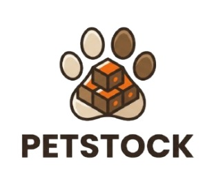 | 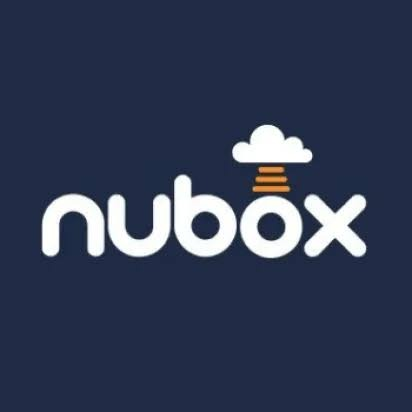 | 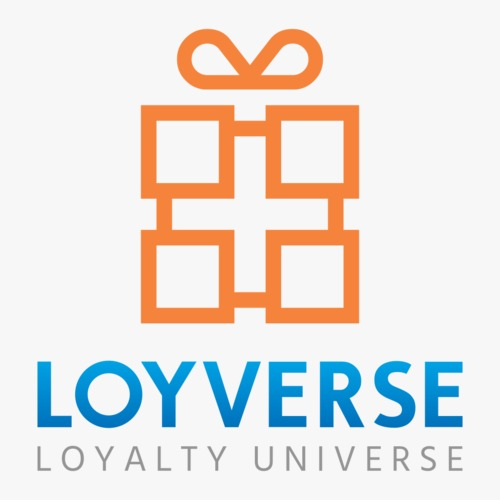 | 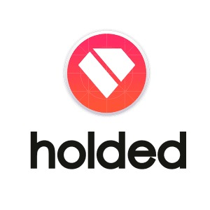 |
| **Perfil: Overview** | Aplicación web SaaS peruana que centraliza la gestión integral de inventarios, control de ventas, compras y alertas automáticas de stock mínimo para pequeñas tiendas de mascotas, adaptándose a las necesidades de los comercios de barrio y boutiques especializadas. | Software de gestión administrativa y contable en la nube enfocado en pequeñas y medianas empresas en Latinoamérica, con fuerte énfasis en el cumplimiento tributario, emisión de comprobantes y automatización de procesos financieros y contables. | Sistema de punto de venta (POS) móvil y web de uso global, enfocado en tiendas de barrio, minimarkets y pequeños comercios minoristas con operaciones comerciales directas. | Software ERP y de gestión empresarial en la nube diseñado para automatizar la facturación, contabilidad, CRM e inventarios de pymes y negocios en crecimiento. |
| **Perfil: Ventaja competitiva** | Enfoque 100% especializado en el flujo de trabajo de las tiendas de mascotas (control de alimentos de alta rotación, accesorios y alertas inteligentes de stock bajo), eliminando el uso de cuadernos tradicionales con una interfaz sencilla. | Fuerte automatización de procesos contables y cumplimiento tributario para negocios, ofreciendo tranquilidad en el cumplimiento de obligaciones administrativas, cálculo automatizado de impuestos y un respaldo legal sólido. | Interfaz sumamente ágil orientada a cobros rápidos, control básico de inventario y gestión operativa desde dispositivos móviles o tablets, permitiendo una alta velocidad en la atención del cliente. | Sistema modular avanzado y altamente personalizable para empresas en crecimiento, ofreciendo la centralización total de la administración financiera, contable y comercial en una sola plataforma robusta. |
| **Marketing: Mercado objetivo** | Dueños y administradores de pequeñas tiendas de barrio enfocadas en consumo frecuente (Sectores C/D) y boutiques especializadas en productos premium (Sectores A/B) en el Perú. | Pequeñas y medianas empresas, estudios contables y comerciantes independientes que requieren un estricto control administrativo y tributario. | Minimarkets, tiendas de barrio, cafeterías y pequeños comercios minoristas generales a nivel global que requieren agilidad en sus ventas diarias. | PyMEs, comercios en crecimiento y empresas de servicios que buscan un ERP integral basado en la nube. |
| **Marketing: Estrategias** | Campañas digitales en redes sociales, alianzas con distribuidores del sector y contacto directo presencial con tenderos locales en zonas comerciales de Lima y provincias. | Marketing de contenidos enfocado en educación de gestión y tributación, pauta publicitaria digital y webinars especializados dirigidos a administradores y contadores. | Posicionamiento orgánico en tiendas de aplicaciones móviles (App Store y Google Play) y estrategias de atracción digital. | Campañas digitales B2B, inbound marketing, pauta en buscadores y asociaciones estratégicas comerciales. |
| **Producto: Servicios** | Plataforma web (Responsive Web App) con módulo de catálogo centralizado, control de inventario en tiempo real, alertas de stock mínimo, registro de ventas, compras y reportes. | Módulos de facturación electrónica, contabilidad, remuneraciones, gastos y portal de gestión para clientes. | Sistema de punto de venta (POS), control de inventario, programa de lealtad para clientes y gestión de empleados. | Módulos de facturación, inventarios avanzados, CRM, gestión de proyectos, contabilidad y tienda online integrada. |
| **Producto: Precios y Costos** | Modelo de suscripción mensual SaaS accesible, diseñado y adaptado a la realidad económica de los pequeños comercios en el Perú. | Planes escalables mensuales basados en el volumen de operaciones o emisión de documentos tributarios. | Aplicación base con funciones gratuitas y módulos avanzados de pago mediante suscripción mensual accesible. | Estructura de planes por niveles de servicio según los módulos operativos contratados y número de usuarios. |
| **Producto: Canales** | Plataforma web responsive accesible desde navegadores de escritorio y dispositivos móviles. Distribución directa vía sitio web corporativo y alianzas sectoriales. | Plataforma web SaaS basada en la nube y aplicación móvil complementaria de soporte operativo. | Aplicación nativa móvil para sistemas iOS/Android y panel web complementario de administración. | Plataforma web SaaS basada en la nube con acceso multiplataforma para la administración del negocio. |
| **SWOT: Fortalezas** | Enfoque especializado en el sector retail de mascotas de la realidad peruana. Interfaz intuitiva diseñada para usuarios sin perfil técnico. Automatización de alertas de stock mínimo para evitar quiebres. | Plataforma madura y robusta con alta confiabilidad en el cálculo tributario y contable. Soporte técnico establecido en el mercado. | Curva de aprendizaje muy baja y excelente velocidad para procesar ventas rápidas desde dispositivos táctiles. | Alta versatilidad modular y capacidad de personalización para diversos tipos de procesos de negocio. |
| **SWOT: Debilidades** | Marca de reciente creación sin reconocimiento previo en el mercado. Recursos iniciales limitados para campañas publicitarias masivas. | Enfoque principalmente contable y tributario, lo que limita su personalización operativa para el control detallado del inventario específico de mascotas. | Capacidades de control de inventario limitadas y poco flexibles para la gestión específica de alertas de stock en productos de mascotas. | Curva de adopción compleja y costos elevados para micro y pequeños comerciantes con baja madurez tecnológica. |
| **SWOT: Oportunidades** | Creciente digitalización de los pequeños comercios en el Perú y aumento sostenido del presupuesto que destinan los hogares al cuidado de mascotas. | Expansión hacia nuevos nichos de mercado minorista que buscan simplificar su administración general. | Crecimiento de la adopción de soluciones de cobro móvil en pequeños negocios latinoamericanos. | Demanda creciente de digitalización y automatización en el sector comercial de la región. |
| **SWOT: Amenazas** | Posible resistencia inicial de los tenderos tradicionales a abandonar los cuadernos y métodos manuales. Llegada de soluciones genéricas internacionales. | Aparición de competidores locales especializados en nichos específicos que desplacen las soluciones genéricas. | Competencia agresiva de aplicaciones gratuitas de punto de venta en el mercado minorista. | Entrada de plataformas ERP internacionales con estrategias de precios agresivas para pymes. |

### 2.1.2. Estrategias y tácticas frente a competidores.
A partir del análisis competitivo realizado frente a Nubox, Loyverse POS y Holded, hemos definido un conjunto de estrategias y tácticas orientadas a afrontar las fortalezas de dichos competidores, aprovechar sus debilidades y posicionar a PetStock (desarrollado por la startup Nexora) como la solución de referencia para la gestión de tiendas de mascotas en el Perú.

* **Estrategia de diferenciación por especialización en el sector retail de mascotas:** Mientras los competidores actuales ofrecen soluciones genéricas orientadas a la contabilidad (Nubox, Holded) o al punto de venta general sin control especializado de insumos veterinarios (Loyverse POS), PetStock se posiciona como la única plataforma diseñada exclusivamente para el flujo operativo de las tiendas de mascotas. La táctica asociada consiste en comunicar de forma directa este diferencial mediante demostraciones comerciales enfocadas en la gestión de alimentos de alta rotación, control por lotes de accesorios y alertas inteligentes de stock mínimo ante los tenderos locales.
* **Estrategia de penetración local y adopción presencial:** Frente al alcance digital masivo pero despersonalizado de las plataformas internacionales y corporativas, la ventaja competitiva más relevante de Nexora es el conocimiento profundo de la realidad comercial peruana (pequeños negocios de los sectores C/D y boutiques de los sectores A/B). La táctica consiste en realizar visitas comerciales presenciales a zonas de alta concentración de veterinarias y tiendas de mascotas en Lima y provincias, reduciendo la resistencia inicial al cambio frente a los cuadernos tradicionales mediante acompañamiento directo y onboarding guiado.
* **Estrategia de precios y costos accesibles para MYPEs:** Considerando que el mercado objetivo está compuesto por pequeños comerciantes con restricciones presupuestales y una baja predisposición a pagar tarifas corporativas elevadas (como las de Holded), PetStock aplicará un modelo financiero ajustado a la realidad local. La táctica consiste en ofrecer un esquema de suscripción mensual SaaS flexible y económico, respaldado por un periodo de prueba inicial sin fricciones que demuestre un ahorro de tiempo administrativo inmediato en el negocio.
* **Estrategia de simplicidad de interfaz frente a la complejidad técnica:** Mientras los sistemas ERP integrales exigen curvas de aprendizaje complejas y personal técnico especializado, PetStock prioriza una experiencia de usuario sumamente intuitiva. La táctica consiste en diseñar una plataforma web responsive ágil, eliminando menús contables confusos y botones innecesarios, permitiendo que el administrador o cajero gestione las ventas y el inventario en pocos clics sin necesidad de conocimientos previos en computación.
* **Estrategia de mitigación ante la resistencia al registro digital:** Ante la inercia de los tenderos tradicionales acostumbrados al uso de cuadernos y registros manuales, PetStock enfoca su propuesta en la prevención directa de pérdidas económicas por quiebres de stock. La táctica consiste en destacar visualmente en las alertas automáticas el dinero exacto que el comerciante deja de perder al reponer a tiempo sus productos más vendidos, convirtiendo la herramienta digital en un aliado indispensable para la rentabilidad diaria del establecimiento.

### 2.2. Entrevistas. 

#### 2.2.1. Diseño de entrevistas.
Las entrevistas constituyen la principal técnica de investigación cualitativa para la validación del problema y la propuesta de valor de PetStock. El objetivo es comprender en profundidad las necesidades, frustraciones, comportamientos actuales y expectativas de los dos segmentos de usuario identificados: los dueños o administradores de pequeñas tiendas de barrio (Sectores C/D) y los propietarios de boutiques especializadas en productos premium (Sectores A/B). 

**Objetivos Generales del Proceso de Entrevistas**
* Validar la existencia y criticidad del problema de desabastecimiento, quiebres de stock y errores en el registro manual de ventas en el sector retail de mascotas.
* Comprender cómo gestionan actualmente sus operaciones comerciales y logísticas los establecimientos, identificando herramientas empíricas utilizadas (como cuadernos o libretas) y puntos de dolor administrativos.
* Explorar la disposición de los dueños de negocios a adoptar una solución SaaS en la nube y su sensibilidad al costo de suscripción.
* Identificar funcionalidades prioritarias y posibles fricciones operativas en la adopción del producto desde la perspectiva de ambos perfiles de usuario.

**Segmento 1: Dueños o Administradores de tiendas tradicionales para mascotas (Sectores C/D)**
* **Perfil del entrevistado:** Propietarios, encargados de caja o administradores de tiendas de mascotas independientes de barrio y minimarkets veterinarios en zonas comerciales de Lima y provincias, caracterizados por un volumen constante de transacciones y una digitalización inicial o moderada.
* **Preguntas de apertura y contexto**
  * ¿Podría contarme brevemente cómo inició su tienda de mascotas y qué tipo de productos tienen mayor rotación en su día a día?
  * ¿Cuántas personas atienden directamente el negocio y cómo se organizan para cubrir la atención al público y la administración?
* **Preguntas sobre gestión operativa actual e inventario**
  * ¿Cómo realiza actualmente el control de su inventario y el registro de la mercadería que ingresa y sale de su tienda?
  * ¿Qué herramientas o métodos utiliza para anotar sus ventas diarias y coordinar los pedidos con sus proveedores?
  * ¿Con qué frecuencia se queda sin stock de un producto muy vendido sin darse cuenta a tiempo? ¿Cómo afecta eso a sus ingresos?
* **Preguntas sobre dolores y fricciones administrativas**
  * Al final del día, ¿qué tan complicado es cuadrar la caja o verificar el dinero físico frente a lo que supuestamente debería haber en el local?
  * ¿Qué errores o pérdidas económicas ha experimentado debido a registros manuales en papel o cuadernos extraviados?
* **Preguntas sobre disposición y adopción tecnológica**
  * Si existiera una plataforma web sencilla que le avise automáticamente cuándo se va a acabar un producto y registre sus ventas al instante, ¿qué tan valiosa sería para usted?
  * ¿Qué barreras o temores principales le impedirían abandonar sus métodos tradicionales por una solución digital?
  * ¿Estaría dispuesto a pagar una suscripción mensual accesible por un software así? ¿Qué rango de precios consideraría razonable para su negocio?

**Segmento 2: Propietarios o Administradores de Boutiques Especializadas (Sectores A/B)**
* **Perfil del entrevistado:** Propietarios o gerentes de boutiques y pet shops especializados en productos premium (alimentos orgánicos, accesorios importados, farmacia veterinaria de alta gama), que operan con un catálogo más diversificado y clientes exigentes.
* **Preguntas de apertura y contexto**
  * ¿Podría describir el concepto de su boutique y qué tipo de perfil de cliente atiende habitualmente en el establecimiento?
  * ¿Cómo manejan la variedad y diversificación de su catálogo, especialmente con productos importados o de marcas exclusivas?
* **Preguntas sobre gestión operativa y control de lotes**
  * ¿Qué sistema o método utiliza actualmente para controlar las fechas de caducidad, lotes y niveles de stock de productos especializados?
  * ¿Cómo gestiona el control de las ventas cruzadas y el seguimiento del historial de compras de sus clientes más frecuentes?
* **Preguntas sobre dolores de control y rentabilidad**
  * ¿Qué dificultades encuentra al momento de realizar inventarios generales en su tienda y cuánto tiempo le demanda esa tarea?
  * ¿Ha tenido mermas o pérdidas por productos vencidos que no se rotaron a tiempo debido a la falta de reportes detallados?
* **Preguntas sobre expectativas y requerimientos del sistema**
  * ¿Qué características indispensables exigiría a una plataforma digital para decidir implementarla en su boutique?
  * ¿Qué tan importante considera contar con reportes analíticos de ventas por categoría para la toma de decisiones comerciales y reposición con proveedores?
  * ¿Estaría dispuesto a migrar la administración completa de su boutique a un modelo de software en la nube si este le garantiza optimizar su capital de trabajo?c

### 2.2.2. Registro de entrevistas

### 2.2.3. Análisis de entrevistas

**Analisis de Entrevista del segmento 1:**

**Puntos de Dolor y Coincidencias Operativas:** Este análisis cuantitativo consolida una necesidad de mercado homogénea: el 100% de los entrevistados comparte el uso del cuaderno, la lentitud en el cierre de caja, la pérdida recurrente de clientes por falta de stock y un alto interés en adoptar una solución digital. La única divergencia radica en la adopción previa de canales digitales de pago (Yape/Plin/WhatsApp), presente en 2 de los 3 casos. Estos hallazgos demuestran que la barrera principal no es el desinterés por la tecnología, sino la falta de un sistema intuitivo, rápido y con soporte para usuarios tradicionales. 

  

**Frecuencia de Quiebres de Stock / Faltantes a la Semana:** El gráfico pone de manifiesto la vulnerabilidad financiera de los negocios al depender de inspecciones visuales o registros no actualizados al día. Araceli registra hasta 3 quiebres de stock por semana y Mateo al menos 1 quiebre semanal en sus productos de mayor rotación (alimentos balanceados), lo que genera una fuga directa de ingresos y la migración inmediata de clientes hacia la competencia. Este indicador valida que la funcionalidad más crítica y demandada por los usuarios es la actualización del inventario con alertas automáticas.

  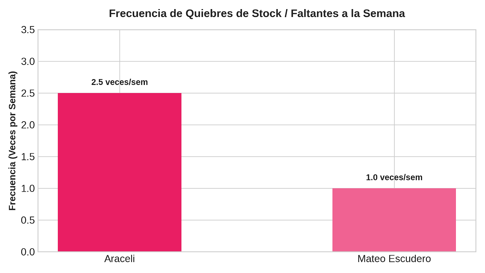

**Tiempo Diario Invertido en Cuadrar Caja Manualmente:** La comparativa de tiempo refleja la enorme ineficiencia operativa que genera el arqueo manual al cruzar ventas en efectivo, Yape y Plin mediante anotaciones en papel. Mientras Araceli pierde entre 30 y 40 minutos diarios en este proceso, Mateo alcanza un punto crítico de hasta 3 horas (180 minutos) debido al procesamiento diferido de boletos y registros en Excel. Esto demuestra que la fricción en el cierre de caja no solo consume tiempo valioso que podría destinarse a la venta, sino que actúa como el principal catalizador de estrés y errores de cálculo al final de la jornada

  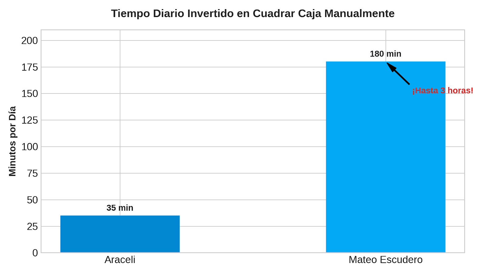

**Rango de Disposición a Pagar (Suscripción Mensual):** Este gráfico evidencia que existe una clara apertura comercial hacia un modelo SaaS (Suscripción Mensual), situando la disposición de pago en un rango promedio entre S/ 30 y S/ 70 mensuales. La mayor valoración proviene de Araceli (S/ 50 - 70), impulsada por la urgencia de evitar pérdidas constantes por accidentes en cuadernos, mientras que Mateo busca una tarifa más austera (S/ 30 - 45) acorde a un negocio familiar de productos de bajo margen. En conjunto, estos datos confirman que un plan escalable cerca a los S/ 40 - 50 mensuales se alinea perfectamente con la capacidad financiera y la percepción de valor de las tiendas de barrio. 

  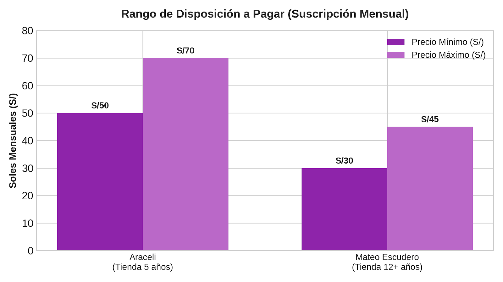

**Analisis de Entrevista del segmento 2:**

**Brecha Digital en Procesos Clave de Boutiques Premium:** Esta representación ilustra la vulnerabilidad del 100% de las boutiques analizadas, las cuales operan sin un software dedicado para la gestión de lotes, la memoria de clientes y el catálogo centralizado. Al depender de la memoria humana (Gabriela), conversaciones dispersas en WhatsApp (Lia) u hojas de cálculo genéricas como Excel (Leonardo y Lia), el negocio incurre en merma financiera directa por productos nicho vencidos al fondo del anaquel y en pérdida de ventas cruzadas. Los datos confirman que existe una disposición total a migrar a una plataforma en la nube limpia y segura siempre que garantice agilidad y un aprendizaje intuitivo sin entrenamientos complejos.

  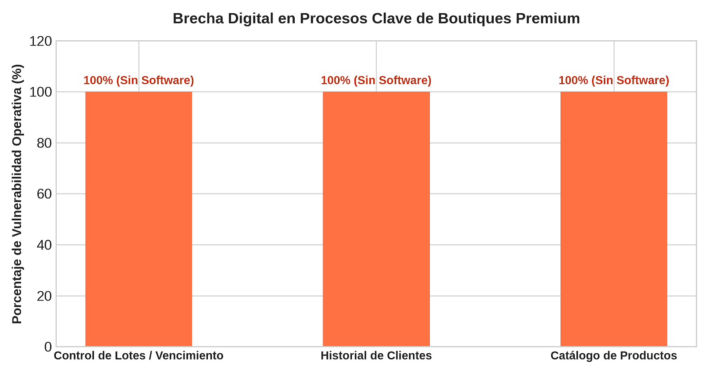

**Puntos Críticos de Gestión en Boutiques Especializadas:** El gráfico horizontal evidencia las coincidencias estructurales en el segmento de boutiques de alta gama. El 100% de los entrevistados (Gabriela, Leonardo y Lia) reporta severas dificultades para controlar productos de baja rotación/vencimientos, realizar el seguimiento de clientes frecuentes y administrar la alta densidad de un catálogo multimarca. Asimismo, un 67% (Leonardo y Lia) demanda reportes analíticos para la toma de decisiones sobre reposición. Esto demuestra que la propuesta de valor para este segmento debe enfocarse en un módulo de fidelización (CRM) integrado con gestión de lotes y alertas de caducidad.

  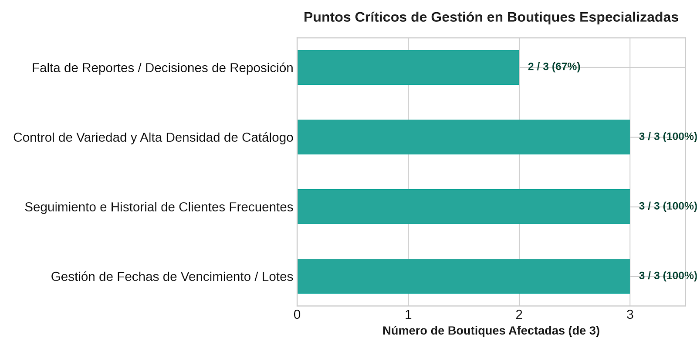

**Carga Horaria en Auditoría e Inspección Manual de Inventario:** Este gráfico expone el costo operativo oculto que representa la falta de un software especializado para catálogos extensos y variados. En el caso de Leonardo ("Wow Closet"), realizar un inventario general exige hasta 8 horas continuas (un día entero fuera de horario o fines de semana), paralizando las actividades operativas del negocio, mientras que Lia dedica aproximadamente 4 horas en revisiones físicas continuas de anaqueles. Esta sobrecarga de horas operativas valida la necesidad urgente de un sistema en la nube con actualización automática que elimine la auditoría física tradicional para proteger la productividad del personal.

  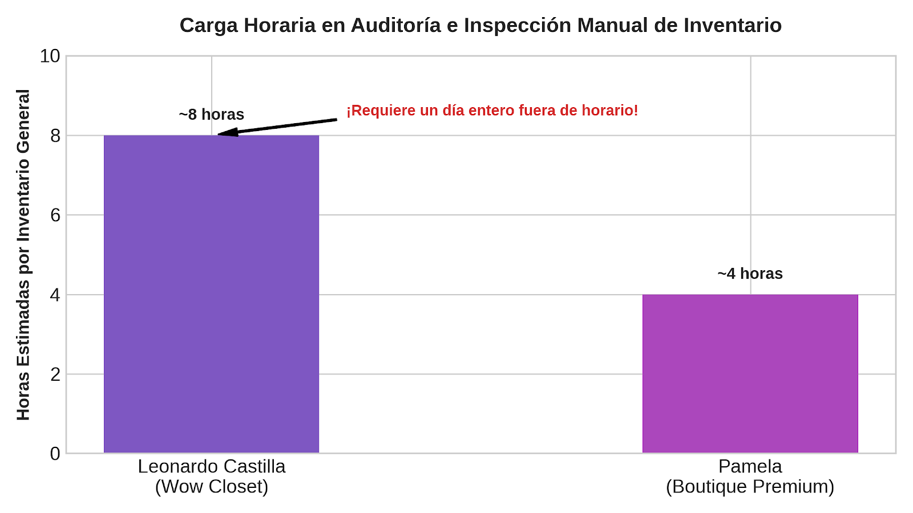

## 2.3. Needfinding

### 2.3.1. User Personas

En esta sección se presentan las fichas de User Persona elaboradas a partir del análisis de los segmentos, las entrevistas y la competencia. Estos perfiles representan a los usuarios objetivo de PetStock, considerando sus principales características, necesidades, objetivos y dificultades. Se desarrollaron dos User Personas: Eduardo Salazar, representante de las tiendas de alimentos y productos de consumo frecuente, y Ximena Díaz, representante de las tiendas especializadas en productos premium y de cuidado para mascotas.

**User Persona del segmento #1: Dueños o Administradores de tiendas tradicionales para mascotas (Sectores C/D)**

  

**User Persona del segmento #2: Dueños o administradores de tiendas especializadas en productos premium y de cuidado para mascotas (Sectores A/B)**

  

### 2.3.2. User Task Matrix

En esta sección se presenta el User Task Matrix, que concentra las principales tareas que realizan los User Personas que representan a los dos segmentos definidos para PetStock. El primer segmento está conformado por pequeñas tiendas de mascotas especializadas principalmente en alimentos y productos de consumo frecuente, mientras que el segundo está conformado por tiendas especializadas o boutiques que comercializan accesorios, productos premium, de higiene y bienestar para mascotas. Las tareas identificadas corresponden a actividades que ambos User Personas realizan para cumplir sus objetivos dentro de la gestión cotidiana de sus negocios, independientemente de la existencia de PetStock. 

Para cada User Persona se evalúan dos dimensiones por tarea. La frecuencia indica con qué regularidad realiza la tarea, expresada en una escala cualitativa de Muy Alta, Alta, Media y Baja. La importancia indica el grado en que la tarea es crítica para el cumplimiento de los objetivos del User Persona, expresada en la misma escala. 

  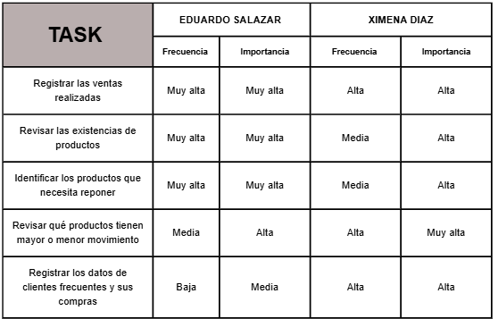

En el caso de Eduardo Salazar, las tareas con mayor frecuencia e importancia son registrar las ventas realizadas, revisar las existencias de productos e identificar los productos que necesita reponer. Esto se relaciona con las características de su negocio, debido a que comercializa principalmente alimentos y productos de consumo frecuente, los cuales presentan una alta rotación. Por ello, necesita revisar constantemente sus existencias para evitar que los productos se agoten y afecten sus ventas. 

Por otro lado, Ximena Díaz presenta una mayor frecuencia e importancia en la tarea de revisar qué productos tienen mayor o menor movimiento. Esto se debe a que su tienda maneja un catálogo más variado de productos premium, accesorios y artículos de cuidado, que generalmente presentan una menor rotación pero un mayor margen por producto. Por ello, necesita prestar mayor atención al comportamiento de los productos para tomar decisiones sobre cuáles mantener o priorizar. 

También existe una diferencia en la tarea de registrar los datos de clientes frecuentes y sus compras. Para Eduardo esta actividad presenta una frecuencia menor, debido a que su negocio está más orientado a la venta frecuente de productos de consumo. En cambio, para Ximena tiene una frecuencia e importancia mayores, ya que el seguimiento de clientes frecuentes puede contribuir a brindar una atención más personalizada y conocer mejor sus hábitos de compra. 

En conclusión, ambos User Personas realizan tareas similares relacionadas con la gestión de sus tiendas, pero sus prioridades son diferentes. Eduardo está principalmente orientado al control operativo, la disponibilidad de productos y la reposición debido a la alta rotación, mientras que Ximena está más orientada al análisis del movimiento de productos y al seguimiento de sus clientes debido a la variedad y especialización de su catálogo. Estas diferencias permiten identificar necesidades específicas dentro de los dos segmentos que serán consideradas en el diseño de PetStock. 

### 2.3.3. User Journey Mapping

Realizamos los User Journey Maps en la version de AS-IS para los dos segmentos , asi podremos entender de forma estructurada la experiencia del usuario en su interaccion con un producto o servicio.

**User Journey Map del 1er segmento objetivo-Tiendas de alimentos y consumo frecuente para mascotas**

     

**User Journey Map del 2do segmento objetivo-Tiendas especializadas en productos premium y de cuidado**

  

### 2.3.4. Empathy Mapping

El Empathy Mapping nos ayuda a entender mas sobre la experiencia cognitica y emocional del usuario.Mediante las secciones sobre el pensamientos , sentimientos ,que dice y hace , se trata de entender sus motivaciones y frustaciones

**Empathy Mapping del 1er segmento objetivo-Tiendas de alimentos y consumo frecuente para mascotas**

  

**Empathy Mapping del 2do segmento objetivo-Tiendas especializadas en productos premium y de cuidado**

  

### 2.4. Big Picture Event Storming

En esta sección se presenta el Big Picture Event Storming del proyecto PetStock, elaborado como una visión general del dominio comercial del retail minorista de mascotas en el Perú.Esta técnica permitió modelar el dominio de negocio rastreando de manera cronológica los eventos significativos que ocurren en las tiendas en el día a día, desde la configuración inicial del catálogo y el abastecimiento de mercadería, hasta el registro de ventas, el control de inventario y el balance de cierre diario.

  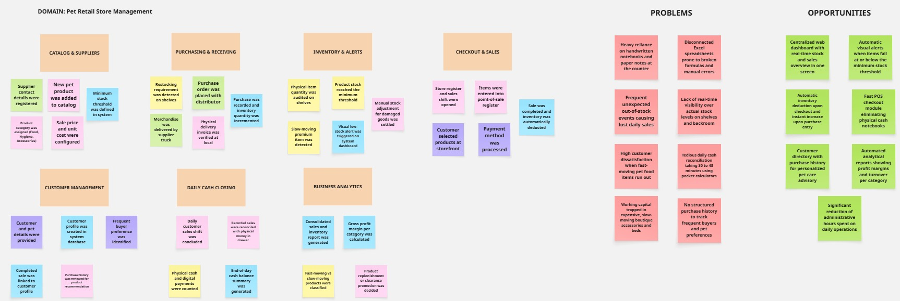

### 2.5. Ubiquitous Language

El siguiente glosario define los términos clave del dominio de gestión comercial de tiendas de mascotas. Su propósito es establecer un lenguaje común entre todos los integrantes del equipo y los stakeholders del proyecto, evitando ambigüedades en la comunicación durante el desarrollo de PetStock.

* High-Rotation Product (Producto de alta rotación): Producto de consumo diario que requiere control constante de reposición para evitar desabastecimiento.

* Premium Product (Producto premium): Producto especializado de cuidado y bienestar animal, caracterizado por menor rotación y mayor margen de ganancia.

* Stock (Existencias): Cantidad disponible de un producto en el inventario de la tienda en un momento dado.

* Minimum Stock Threshold (Stock mínimo): Cantidad límite establecida para un producto, por debajo de la cual se genera una alerta de reposición.

* Stock Alert (Alerta de stock): Notificación generada cuando un producto alcanza o baja del stock mínimo.

* Stock Turnover (Rotación de stock): Frecuencia con la que un producto se vende y repone en un periodo determinado.

* Supplier (Proveedor): Persona o empresa que abastece de productos a la tienda de mascotas.

* Purchase History (Historial de compras): Registro de las compras anteriores realizadas por un cliente, utilizado para dar seguimiento a compradores recurrentes.

* Store Administrator (Administrador de tienda): Persona encargada de gestionar las operaciones diarias de la tienda dentro del sistema.

# Capítulo III: Requirements Specification

## 3.1. User Stories

| ID | Título | Descripción | Criterios de Aceptación | Epic |
|---|---|---|---|---|
| EP01 | Identity & Access | Agrupa las funcionalidades de creación de cuenta, inicio y cierre de sesión de los usuarios de la Web Application. | — | — |
| US01 | Crear cuenta | Como administrador de tienda, quiero crear una cuenta en PetStock, para gestionar las operaciones de mi negocio desde la plataforma. | Escenario 1: Registro exitoso; Dado que el usuario completa el formulario con datos válidos y acepta los términos y condiciones; Cuando presiona "Registrarse"; Entonces el sistema crea la cuenta y lo redirige al Dashboard principal. Escenario 2: Correo ya registrado; Dado que el correo ingresado ya existe en el sistema; Cuando el usuario envía el formulario; Entonces el sistema retorna un error indicando que el correo ya está registrado. | EP01 |
| US02 | Iniciar sesión | Como administrador de tienda, quiero iniciar sesión en mi cuenta, para acceder a las funcionalidades de gestión de mi negocio. | Escenario 1: Credenciales válidas; Dado que el usuario ingresa correo y contraseña correctos; Cuando presiona "Iniciar sesión"; Entonces el sistema valida las credenciales y lo redirige al Dashboard. Escenario 2: Credenciales inválidas; Dado que el usuario ingresa credenciales incorrectas; Cuando presiona "Iniciar sesión"; Entonces el sistema retorna un error sin especificar el campo incorrecto. | EP01 |
| US03 | Cerrar sesión | Como administrador de tienda, quiero cerrar sesión en mi cuenta desde el menú de perfil, para proteger la información de mi negocio cuando no esté utilizando la aplicación. | Escenario 1: Cierre exitoso; Dado que el usuario está autenticado; Cuando presiona "Cerrar sesión" en la vista de Mi Perfil; Entonces el sistema invalida la sesión activa y lo redirige a la pantalla de inicio de sesión. | EP01 |
| EP02 | Product & Inventory Management | Agrupa las funcionalidades de registro, edición, consulta de productos y control de existencias en el inventario. | — | — |
| US04 | Registrar producto | Como administrador de tienda, quiero registrar un nuevo producto en el catálogo, para mantener organizada mi oferta de venta. | Escenario 1: Registro exitoso; Dado que el administrador proporciona datos válidos del producto, incluyendo proveedor y stock mínimo; Cuando presiona "Guardar producto"; Entonces el sistema agrega el producto al catálogo y actualiza el Dashboard. Escenario 2: Datos incompletos; Dado que el administrador omite campos obligatorios; Cuando envía la solicitud; Entonces el sistema retorna un error indicando los campos faltantes. | EP02 |
| US05 | Editar producto | Como administrador de tienda, quiero editar la información de un producto existente, para mantener actualizados sus datos. | Escenario 1: Edición exitosa; Dado que el administrador modifica datos válidos de un producto existente; Cuando confirma los cambios; Entonces el sistema actualiza la información y confirma la operación. Escenario 2: Producto no encontrado; Dado que el administrador intenta editar un producto inexistente; Cuando envía la solicitud; Entonces el sistema retorna un error indicando que el recurso no existe. | EP02 |
| US06 | Consultar inventario | Como administrador de tienda, quiero consultar las cantidades disponibles de mis productos, para conocer el estado actual de mi stock. | Escenario 1: Consulta con resultados; Dado que existen productos registrados con stock; Cuando el administrador solicita la consulta; Entonces el sistema retorna la cantidad disponible de cada producto. Escenario 2: Inventario vacío; Dado que la tienda no tiene productos registrados; Cuando el administrador solicita la consulta; Entonces el sistema retorna una respuesta vacía. | EP02 |
| US07 | Recibir alerta de stock mínimo | Como administrador de tienda, quiero recibir una alerta cuando un producto llegue a su stock mínimo, para reponerlo a tiempo. | Escenario 1: Umbral alcanzado; Dado que la cantidad disponible de un producto es igual o menor al stock mínimo configurado; Cuando el sistema actualiza el inventario; Entonces el sistema genera una alerta visible en el Dashboard. Escenario 2: Stock repuesto; Dado que un producto en alerta recibe una nueva entrada de stock que supera el umbral; Cuando el sistema actualiza el inventario; Entonces el sistema retira la alerta. | EP02 |
| EP03 | Sales & Purchases | Agrupa las funcionalidades de registro de ventas, compras y solicitud de reposición a proveedores. | — | — |
| US08 | Registrar venta | Como administrador de tienda, quiero registrar una venta indicando los productos y el cliente, para actualizar automáticamente mi inventario. | Escenario 1: Venta exitosa; Dado que el administrador selecciona productos con stock disponible e ingresa el nombre del cliente; Cuando confirma la venta; Entonces el sistema descuenta las cantidades del inventario y la registra en el historial. Escenario 2: Stock insuficiente; Dado que la cantidad solicitada supera el stock disponible; Cuando el administrador intenta confirmar la venta; Entonces el sistema retorna un error indicando stock insuficiente. | EP03 |
| US09 | Registrar compra a proveedor | Como administrador de tienda, quiero registrar una compra realizada a un proveedor, para actualizar mi inventario con la mercadería reabastecida. | Escenario 1: Compra exitosa; Dado que el administrador registra una compra con productos y cantidades válidas; Cuando confirma la operación; Entonces el sistema incrementa las cantidades correspondientes en el inventario. Escenario 2: Proveedor no registrado; Dado que el proveedor indicado no existe en el sistema; Cuando el administrador envía la solicitud; Entonces el sistema retorna un error indicando que el proveedor no está registrado. | EP03 |
| US10 | Solicitar reposición a proveedor | Como administrador de tienda, quiero solicitar la reposición de un producto en alerta directamente a un proveedor sugerido por el sistema, para asegurar un reabastecimiento oportuno sin buscar manualmente su información de contacto. | Escenario 1: Solicitud generada; Dado que el administrador selecciona un producto en alerta crítica y un proveedor de la lista sugerida; Cuando presiona "Contactar proveedor"; Entonces el sistema genera la solicitud con la cantidad sugerida y la envía por el canal de contacto configurado. Escenario 2: Sin proveedor asociado; Dado que el producto en alerta no tiene un proveedor asignado; Cuando el administrador intenta solicitar reposición; Entonces el sistema retorna un mensaje indicando que debe asignar un proveedor primero. | EP03 |
| EP04 | Customer & Supplier Management | Agrupa las funcionalidades de registro y consulta de clientes y proveedores de la tienda. | — | — |
| US11 | Registrar proveedor | Como administrador de tienda, quiero registrar la información de mis proveedores, para facilitar el proceso de reposición. | Escenario 1: Registro exitoso; Dado que el administrador proporciona datos válidos del proveedor; Cuando envía la solicitud; Entonces el sistema registra al proveedor y confirma la operación. | EP04 |
| US12 | Consultar historial de cliente | Como administrador de tienda, quiero consultar el historial de compras de un cliente, para dar un mejor seguimiento a mis compradores frecuentes. | Escenario 1: Historial disponible; Dado que el cliente seleccionado tiene compras registradas; Cuando el administrador consulta su perfil; Entonces el sistema retorna el historial de compras asociado. Escenario 2: Cliente sin historial; Dado que el cliente no tiene compras registradas; Cuando el administrador consulta su perfil; Entonces el sistema retorna una respuesta vacía. | EP04 |
| EP05 | Reporting & Dashboard | Agrupa las funcionalidades de generación, consulta y exportación de reportes, y visualización general del negocio. | — | — |
| US13 | Visualizar panel de control | Como administrador de tienda, quiero ver un resumen general del estado de mi negocio al ingresar al sistema, para conocer rápidamente mi situación diaria. | Escenario 1: Panel disponible; Dado que el administrador inicia sesión en el sistema; Cuando accede al Dashboard; Entonces el sistema muestra un resumen de ventas, inventario y alertas activas. | EP05 |
| US14 | Consultar reportes | Como administrador de tienda, quiero consultar reportes de ventas por día, productos con mayor y menor rotación, para tomar mejores decisiones comerciales. | Escenario 1: Reporte generado; Dado que existen datos registrados en el periodo solicitado; Cuando el administrador solicita el reporte; Entonces el sistema retorna la información correspondiente al periodo indicado. Escenario 2: Sin datos en el periodo; Dado que no existen registros en el periodo solicitado; Cuando el administrador solicita el reporte; Entonces el sistema retorna una respuesta vacía. | EP05 |
| US15 | Descargar reporte en PDF | Como administrador de tienda, quiero descargar mis reportes en formato PDF, para respaldar la información de mi negocio. | Escenario 1: Descarga exitosa; Dado que el administrador visualiza un reporte generado; Cuando presiona "Descargar reporte en PDF"; Entonces el sistema genera el archivo y lo descarga correctamente. Escenario 2: Error en la generación; Dado que ocurre un fallo al generar el archivo; Cuando el administrador solicita la descarga; Entonces el sistema retorna un mensaje indicando que la operación no pudo completarse. | EP05 |
| EP06 | Profile & Configuration | Agrupa las funcionalidades de gestión del perfil del usuario y los datos del negocio. | — | — |
| US16 | Actualizar datos del negocio | Como administrador de tienda, quiero editar mi nombre, apellido, correo y contraseña, para mantener actualizada la información de mi perfil y la seguridad de mi cuenta. | Escenario 1: Actualización exitosa; Dado que el administrador proporciona datos válidos; Cuando presiona "Guardar cambios"; Entonces el sistema aplica los cambios y confirma la operación. Escenario 2: Datos inválidos; Dado que el administrador ingresa información con formato incorrecto; Cuando envía la solicitud; Entonces el sistema retorna un error indicando los campos con formato inválido. | EP06 |
| EP07 | Landing Page | Agrupa las funcionalidades del sitio web estático que comunica la propuesta de valor de PetStock a los visitantes de cada segmento objetivo. | — | — |
| US17 | Conocer la propuesta de valor | Como visitante, quiero conocer la propuesta de valor de PetStock, para evaluar si la plataforma se ajusta a las necesidades de mi tienda. | Escenario 1: Contenido disponible; Dado que el visitante accede al Landing Page; Cuando el sistema entrega el contenido principal; Entonces el sistema muestra la información del propósito y beneficio central de la plataforma. | EP07 |
| US18 | Conocer beneficios por segmento | Como visitante del segmento de tiendas de alta rotación, quiero conocer los beneficios específicos de PetStock, para comprender cómo se adapta al control de productos de alto movimiento. | Escenario 1: Contenido por segmento; Dado que el visitante solicita el contenido dirigido a su segmento; Cuando el sistema procesa la solicitud; Entonces el sistema retorna información orientada al control de inventario de alta rotación. | EP07 |
| US19 | Acceder al registro desde el Landing Page | Como visitante, quiero acceder directamente a la Web Application desde el Landing Page, para comenzar a usar PetStock. | Escenario 1: Redirección exitosa; Dado que el visitante hace clic en el call-to-action correspondiente; Cuando el sistema procesa la solicitud; Entonces el sistema redirige al visitante a la vista de creación de cuenta de la Web Application. | EP07 |
| EP08 | Technical Stories | Agrupa los requerimientos técnicos del RESTful API que sustentan la operación del sistema. | — | — |
| US20 | Autenticar usuario | Como developer, quiero implementar un endpoint de autenticación, para que los usuarios accedan de forma segura al sistema. | Escenario 1: Credenciales válidas; Dado que se envía una solicitud POST con credenciales válidas; Cuando el servidor valida los datos; Entonces responde con un token de acceso y código 200. Escenario 2: Credenciales inválidas; Dado que las credenciales enviadas son incorrectas; Cuando el servidor procesa la solicitud; Entonces responde con código 401. | EP08 |
| US21 | Exponer endpoint de inventario | Como developer, quiero implementar un endpoint que devuelva el estado del inventario, para que la Web Application pueda mostrarlo. | Escenario 1: Consulta exitosa; Dado que se envía una solicitud GET con un token válido; Cuando el servidor procesa la solicitud; Entonces responde con la lista de productos y cantidades en formato JSON y código 200. Escenario 2: Token inválido; Dado que el token enviado no es válido; Cuando el servidor procesa la solicitud; Entonces responde con código 401. | EP08 |
| EP09 | Cash Management | Agrupa las funcionalidades de cierre de turno y cuadre de caja diario, permitiendo verificar que el efectivo disponible coincida con el total de ventas registradas durante la jornada. | — | — |
| US22 | Cerrar turno de caja | Como administrador de tienda, quiero cerrar mi turno de caja al final del día, para cuadrar el efectivo con las ventas registradas. | Escenario 1: Cierre exitoso; Dado que el administrador confirma el cierre del turno; Cuando presiona "Cerrar caja"; Entonces el sistema calcula el total esperado en base a las ventas registradas y registra el cierre. | EP09 |
| US23 | Consultar resumen de cuadre | Como administrador de tienda, quiero ver un resumen del cuadre de caja diario, para verificar que el efectivo coincida con las ventas del día. | Escenario 1: Cuadre correcto; Dado que el efectivo contado coincide con el monto calculado por el sistema; Cuando el administrador confirma el cuadre; Entonces el sistema registra el cierre como conforme. Escenario 2: Diferencia detectada; Dado que el efectivo contado no coincide con el monto calculado; Cuando el administrador confirma el cuadre; Entonces el sistema registra la diferencia y la marca para revisión. | EP09 |

## 3.2. Impact Mapping

El Impact Mapping permitió relacionar los objetivos de negocio de PetStock con los actores que intervienen en la plataforma, los cambios de comportamiento que se esperan de ellos y las funcionalidades necesarias para alcanzar dichos objetivos. A partir de este análisis, se priorizaron acciones relacionadas con el control de inventario, la adopción recurrente de la aplicación y la reducción de tareas administrativas.

### Business Goal 1

> Reducir en al menos un 20% los quiebres de stock en las tiendas usuarias de PetStock durante los primeros 6 meses de uso de la plataforma.

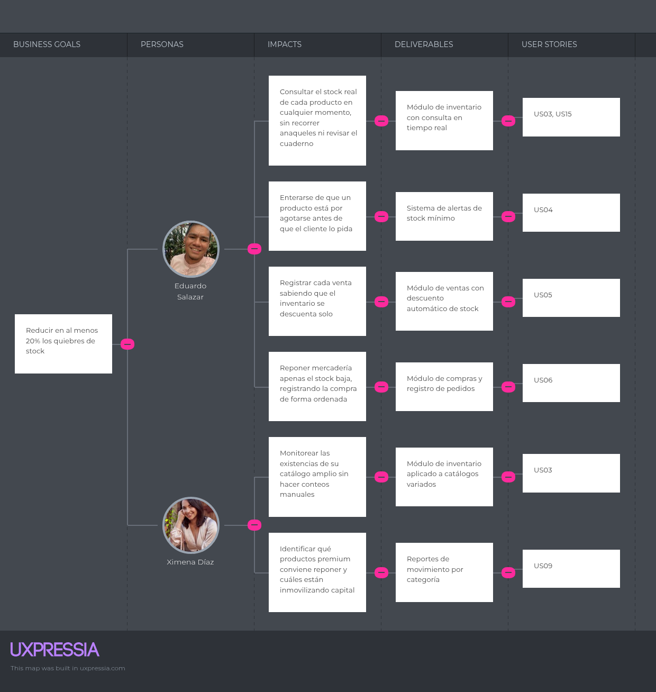

Este objetivo se enfoca en que los administradores puedan identificar productos con existencias bajas y tomar decisiones de reposición antes de perder una venta por falta de stock.

### Business Goal 2

> Lograr que al menos el 70% de los usuarios registrados utilice PetStock de manera recurrente, 4 o más días por semana, durante los primeros 3 meses posteriores al despliegue.

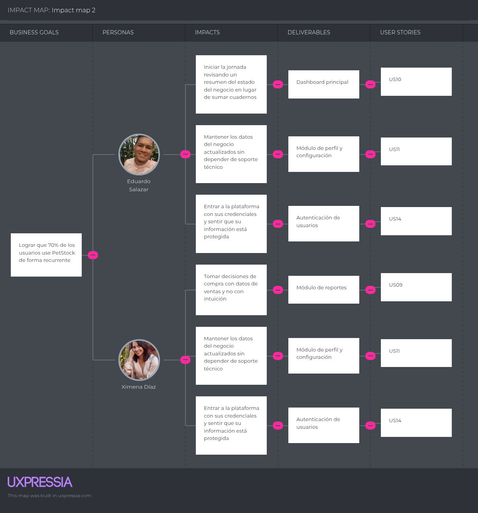

Este objetivo busca que la plataforma forme parte de la operación diaria de la tienda. Para ello, las funcionalidades priorizadas deben ser simples de usar y resolver tareas que el administrador realiza todos los días.

### Business Goal 3

> Reducir en al menos un 30% el tiempo que los administradores dedican a tareas administrativas, como el registro de ventas, compras e inventario, durante los primeros 3 meses de uso.

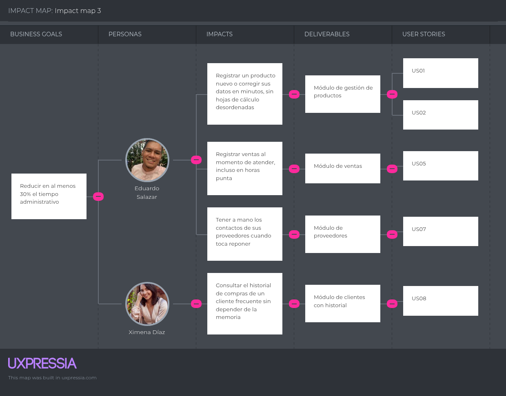

Este objetivo se relaciona con centralizar las operaciones del negocio en una sola plataforma, evitando registros duplicados entre cuadernos, hojas de cálculo y notas separadas.

## 3.3 Product Backlog

El Product Backlog reúne y ordena los User Stories de PetStock según el valor que aportan al negocio y la necesidad de los segmentos objetivo. La priorización inicia con la propuesta de valor y las funcionalidades que permiten administrar productos e inventario, debido a que estas se relacionan directamente con la reducción de quiebres de stock.

| Orden | User Story ID | Título | Descripción | Story Points |
|---:|---|---|---|---:|
| 1 | US12 | Conocer la propuesta de valor | Como visitante, deseo conocer la propuesta de valor de PetStock, para evaluar si la plataforma se ajusta a las necesidades de mi tienda. | 2 |
| 2 | US13 | Conocer beneficios por segmento | Como visitante del segmento de tiendas de alta rotación, deseo conocer los beneficios específicos de PetStock, para comprender cómo se adapta al control de productos de alto movimiento. | 3 |
| 3 | US01 | Registrar producto | Como administrador de tienda, deseo registrar un nuevo producto en el catálogo, para mantener organizada mi oferta de venta. | 3 |
| 4 | US03 | Consultar inventario | Como administrador de tienda, deseo consultar las cantidades disponibles de mis productos, para conocer el estado actual de mi stock. | 3 |
| 5 | US04 | Recibir alerta de stock mínimo | Como administrador de tienda, deseo recibir una alerta cuando un producto llegue a su stock mínimo, para reponerlo a tiempo. | 3 |
| 6 | US14 | Autenticar usuario | Como developer, deseo implementar un endpoint de autenticación, para que los usuarios accedan de forma segura al sistema. | 5 |
| 7 | US15 | Exponer endpoint de inventario | Como developer, deseo implementar un endpoint que devuelva el estado del inventario, para que la Web Application pueda mostrarlo. | 3 |
| 8 | US05 | Registrar venta | Como administrador de tienda, deseo registrar una venta indicando los productos y el cliente, para actualizar automáticamente mi inventario. | 5 |
| 9 | US02 | Editar producto | Como administrador de tienda, deseo editar la información de un producto existente, para mantener actualizados sus datos. | 3 |
| 10 | US06 | Registrar compra a proveedor | Como administrador de tienda, deseo registrar una compra realizada a un proveedor, para actualizar mi inventario con la mercadería reabastecida. | 5 |
| 11 | US07 | Registrar proveedor | Como administrador de tienda, deseo registrar la información de mis proveedores, para facilitar el proceso de reposición. | 3 |
| 12 | US10 | Visualizar panel | Como administrador de tienda, deseo ver un resumen general del estado de mi negocio, para conocer rápidamente mi situación diaria. | 5 |
| 13 | US09 | Consultar reportes | Como administrador de tienda, deseo consultar reportes de ventas, compras e inventario, para tomar mejores decisiones comerciales. | 5 |
| 14 | US08 | Consultar historial de cliente | Como administrador de tienda, deseo consultar el historial de compras de un cliente, para dar un mejor seguimiento a mis compradores frecuentes. | 3 |
| 15 | US11 | Actualizar datos del negocio | Como administrador de tienda, deseo actualizar la información de mi perfil y de mi negocio, para mantener los datos administrativos correctos. | 3 |

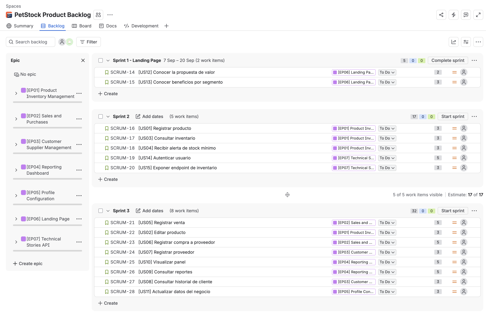

El Product Backlog se encuentra gestionado en Jira y puede revisarse en el siguiente enlace:

[Ver Product Backlog de PetStock en Jira](https://avalladolid.atlassian.net/jira/software/projects/SCRUM/boards/1/backlog?epics=visible&atlOrigin=eyJpIjoiZDZjYmFmN2UyMzgzNDFkM2IyZmQ5NzhhMTkyYTY2ZDMiLCJwIjoiaiJ9)

# Capítulo IV: Product Design

## 4.1. Style Guidelines

### 4.1.1. General Style Guidelines

**Branding**

  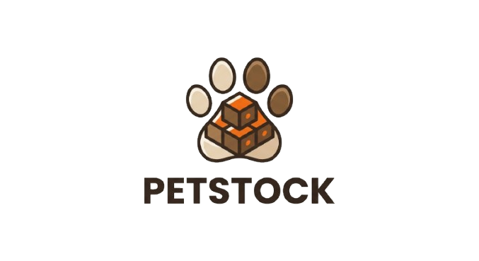

- **Identidad:**

   PetStock representa la combinación entre el mundo de las mascotas y la gestión tecnológica de pequeños negocios. La marca proyecta cercanía, organización, confianza y eficiencia, dirigida principalmente a propietarios y administradores de pequeñas tiendas de productos para mascotas que buscan mejorar el control de sus productos, ventas e inventario mediante una solución web sencilla y accesible.

- **Paleta de Colores:**
  
   - **#ED6B15 (Naranja):** Es el color principal de PetStock. Transmite energía, dinamismo y cercanía, características relacionadas con el mundo de las mascotas y con una herramienta que busca hacer más ágiles las actividades diarias de una tienda.
   - **#825D38 (Marrón):** Representa confianza, estabilidad y naturalidad. Se relaciona con el cuidado de las mascotas y aporta una sensación cálida y confiable a la identidad de la marca.
   - **#E5D0B1 (Beige):** Aporta calidez, tranquilidad y cercanía, funcionando como un color complementario que suaviza la identidad visual y permite generar interfaces más amigables.
   - **#F8F5EF (Crema):** Se utiliza principalmente como fondo, proporcionando limpieza, claridad y neutralidad, facilitando la lectura de la información dentro de la plataforma.
   - **#2F2019 (Marrón oscuro):** Representa seriedad, profesionalismo y estabilidad. Se emplea para textos y elementos de contraste, reforzando el carácter tecnológico y empresarial de PetStock.

- **Simbolismo:**

   - **Huella de mascota:** Representa directamente el mundo de las mascotas, estableciendo una conexión visual inmediata con el público objetivo de PetStock.
   - **Cajas de productos:** Representan el inventario y la gestión de productos de las tiendas para mascotas, uno de los principales problemas que busca solucionar la plataforma.
   - **Combinación de ambos elementos:** La unión de la huella con las cajas representa la integración entre el negocio de productos para mascotas y la gestión tecnológica del inventario, transmitiendo que PetStock permite administrar el negocio de manera más organizada y eficiente.

- **Mensaje de la marca:**

   - **Organización y control:** PetStock comunica una solución que permite centralizar la información de productos, ventas e inventario, facilitando que los propietarios tengan un mayor control sobre las operaciones de su negocio.
   - **Eficiencia y simplicidad:** La identidad visual busca transmitir que administrar una tienda para mascotas no tiene que ser complicado. PetStock busca reducir el tiempo dedicado a tareas administrativas y facilitar las actividades diarias.
   - **Confianza y cercanía:** Los tonos marrones y beige transmiten estabilidad y calidez, mientras que el naranja aporta energía y dinamismo. En conjunto, representan una herramienta confiable, accesible y cercana a las necesidades de las pequeñas tiendas.
   - **Prevención de quiebres de stock:** La representación de las cajas de productos también se relaciona con el propósito de mantener un mejor control de las existencias y detectar productos que necesitan reposición.

- **Aplicación del branding:**

    - **Sitio web y aplicación:** Uso de una interfaz limpia y amigable, empleando el naranja como color de acción y los tonos crema y beige como fondos, acompañados de iconos relacionados con mascotas, productos, ventas e inventario.
    - **Redes sociales y presentaciones digitales:**
    Aplicación consistente del logotipo, la paleta de colores y elementos gráficos relacionados con mascotas y gestión empresarial para mantener una identidad reconocible.
    - **Identidad visual corporativa:** Uso estratégico del logotipo y colores corporativos en tarjetas de presentación, presentaciones empresariales, documentos, material promocional e imágenes de perfil utilizadas para contactar con clientes.

**Tipografía**

La tipografía de PetStock cumple un papel importante en la expresión de la identidad de nuestra marca, transmitiendo una sensación de cercanía, claridad, confianza y modernidad. La marca utiliza una combinación tipográfica que busca representar una plataforma tecnológica amigable y fácil de utilizar, brindando comodidad y una lectura clara tanto en la landing page como en la aplicación web.

- **Tipografía del Logo y Títulos:**
   Para el logo y los títulos de PetStock se ha elegido la tipografía Poppins, perteneciente a la familia Poppins Font Family. Esta tipografía comunica modernidad, dinamismo y profesionalismo, características que se relacionan con una plataforma digital orientada a facilitar la gestión de las tiendas de mascotas. Sus formas geométricas y equilibradas permiten que el nombre de PetStock tenga una apariencia clara, actual y fácil de reconocer. Además, su estructura permite destacar títulos y elementos importantes de la interfaz sin perder la sensación de cercanía que busca transmitir la marca.

   

   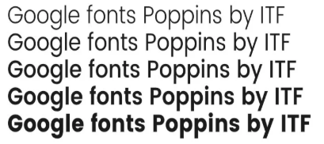
   

- **Tipografía de Texto Regular:**
   Para los textos de la landing page y de la aplicación se ha elegido la tipografía Roboto, perteneciente a la familia Roboto Font Family, debido a su excelente legibilidad y claridad en interfaces digitales. Esta tipografía permite que la información relacionada con productos, ventas, inventario y proveedores pueda ser visualizada de manera cómoda y ordenada. Asimismo, su diseño sencillo y funcional refuerza los valores de practicidad, accesibilidad y eficiencia que PetStock busca ofrecer a los pequeños negocios de productos para mascotas.

   

   
   

**Colores**

Es importante elegir los colores para las plataformas digitales adecuadamente, ya que así se asegura que la experiencia del usuario sea placentera y agradable. Por ello, nos aseguramos de que la paleta de colores seleccionada de PetStock refleje la esencia de la startup, transmitiendo cercanía, confianza, modernidad y dinamismo tanto en la landing page como en nuestra aplicación.

   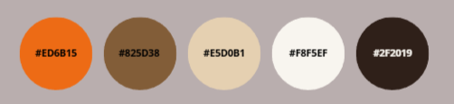

**Espaciado**

- Interlineado: 140%-160% para facilitar la lectura de la información en pantallas móviles.
- Padding en botones: 12px vertical × 20px horizontal como mínimo, permitiendo que los botones sean cómodos de tocar y fáciles de identificar.
- Margen entre secciones: 24px-32px para mantener una separación visual adecuada sin desperdiciar espacio en la pantalla del celular.
- Espaciado entre elementos: 8px-16px para mantener una jerarquía visual clara entre títulos, textos, campos y componentes.
- Grid base: Utilizar un grid de 8px para mantener consistencia y alineación en los diferentes elementos de la aplicación.

Esto transmite un espaciado limpio, ordenado y funcional, facilitando la navegación desde dispositivos móviles. Además, permite que PetStock mantenga una interfaz sencilla y accesible, acorde con su objetivo de simplificar la gestión de productos, ventas e inventario para las tiendas de mascotas

Tono de Comunicación y Lenguaje Aplicado

- El tono de PetStock es cercano, amigable, claro, práctico, moderno y confiable, diseñado para generar confianza en los dueños y administradores de tiendas de mascotas, utilizando un lenguaje sencillo y fácil de comprender.
- PetStock acompaña a los usuarios en sus actividades diarias de gestión, comunicando de manera clara y directa cómo la tecnología puede facilitar el control de productos, ventas, inventario y proveedores.
- El lenguaje se mantiene simple y funcional, priorizando la acción y la facilidad de uso. Se evita el exceso de tecnicismos y se apuesta por una comunicación directa que permita a los usuarios comprender rápidamente las funciones de la plataforma.
- El estilo comunicativo está alineado con los principios de PetStock: simplificar, organizar y facilitar la gestión de las tiendas de mascotas.

### 4.1.2. Web Style Guidelines

**Responsive Design Principles**

El diseño web responsive orienta el desarrollo a considerar diseños alternos para mejorar la experiencia del usuario desde diferentes plataformas.

* Mobile-First Approach: Se presta atención a las formas en que las personas usan los dispositivos móviles colocando el contenido primero y considerando gestos y movimientos del mundo real.

* Adaptabilidad: La web se adapta a todo tipo de dispositivos de forma sencilla, intuitiva y agradable, optimizando la usabilidad.

**Design Principles**

La interfaz de PetStock se fundamenta en el principio de diseño C.R.A.P

* Alignment : Cada elemento en el diseño está visualmente unido a otro permitiendo consistencia para que nada se sienta fuera de lugar.

* Repetition: Se repiten patrones establecidos como estilos tipográficos o bordes específicos para generar consistencia visual.

**Usability & Component States**

Los componentes y estados de la interfaz se rigen por las heurísticas de usabilidad de para asegurar un alto grado de aceptación

* Libertad y control del usuario: En caso de elegir una opción por error, el usuario dispone de un tipo de salida de emergencia visible para abandonar ese estado lo que le permite deshacer o cancelar acciones

* Consistencia y estándares: Se mantiene un estándar visual para que los elementos interactivos sean lo mismo y consistentes en diferentes pantallas.
Reconocer antes que recordar: Las acciones y opciones como botones de guardado son siempre visibles para evitar que la persona que atienda tenga que recordar información entre distintas secciones

**Form Elements & Getting Input**

Los elementos de formulario en PetStock aplican patrones de Getting input para agilizar las tareas de gestión de inventario y ventas.

* Prevención de errores: Los formularios integran funcionalidades como el autocomplete para ayudar a que el usuario no tenga que escribir toda la palabra como cuando busque un producto o el cliente y no se equivoque

* Diseño Limpio: Las pantallas de registro no contienen información innecesaria, ya que cada elemento extra compite con la información relevante y disminuye su visibilidad

**Navigation Patterns**

Los patrones de navegación otorgan armonía a la presentación y evitan inconsistencias que malogren la experiencia del usuario.

* Global Navigation: Se emplea la etiqueta semántica HTML `<nav>`para contener y estructurar los enlaces de navegación principales, ya sea en menús horizontales o laterales

* Encabezados: Se utiliza la etiqueta `<header>` para definir los encabezados de las secciones y orientar al usuario dentro del Dashboard o los reportes.

* Footer: Se emplea la etiqueta `<footer>` para contener información secundaria en la parte inferior de la página

## 4.2. Information Architecture

La Arquitectura de la Información (IA) es todo lo relacionado a la organización de la información de forma clara y lógica.El diseño de PetStock se fundamenta en comprender como las personas estructuran la información de forma mental y evitar someterlas a una sobrecarga cognitiva durante su jornada

### 4.2.1. Organization Systems

El sistema de organización de PetStock define cómo se dispone el contenido para alinearse con los modelos mentales de los administradores y dueños de tienda, es decir, las suposiciones que tienen en mente antes de interactuar con la aplicación 

* Taxonomy : Es la disposición en partes claramente articuladas y define el método de organización. En PetStock usamos los conceptos para definir las cosas por similitud

* Organización por tópicos: Agrupa las funciones por la naturaleza operativa del negocio como inventario y ventas

* Organización cronológica : Ordena las vistas basadas en el tiempo como el "Historial de compras" de clientes o las métricas de "Ventas por día"

* Clasificación multiple: Asumimos que diferentes personas pueden usar diferentes formas  para encontrar la información. Entonces hacemos que el inventario permita búsquedas alfabéticas, por categorías o filtros directos de stock

* Choreography: Se decide la ubicación de los grupos según la importancia que tiene

* Jerarquía visual : Está directamente conectada a la legibilidad del contenido. Considerando los scanning patterns, los usuarios dan un vistazo rápido para ver si la información les interesa antes de leer toda la página. Por esto,el resumen financiero y las alertas de stock crítico encabezan el Dashboard

* Principios Gestalt : Agrupamos elementos visuales según su similitud, si están cerca o lejos y explorando la percepción visual de los elementos en relación unos con otros

* Patrones de diseño: Las tablas de datos como el catálogo de inventario o el historial de ventas  aplican un Patrón F , mientras que el Landing Page utiliza un Patrón Z para guiar visualmente al usuario hacia los botones de registro

### 4.2.2. Labeling Systems

Para el ecosistema de PetStock las etiquetas aplican estrictamente las heurísticas de diseño para garantizar la comprensión

* La aplicación utiliza el lenguaje del usuario con expresiones y palabras que le resulten familiares en el entorno del comercio minorista como precio venta o stock mínimo

* Los usuarios no tienen porqué saber que diferentes palabras, situaciones o acciones significan lo mismo, por lo que se mantienen convenciones inmutables en toda la plataforma

* Las acciones y opciones de navegación se hacen completamente visibles para que el usuario no tenga que recordar información entre distintas secciones

* Las etiquetas de los botones son claras,útiles y libres de jerga indicando una acción directa como "Registrar venta"

### 4.2.3. SEO Tags and Meta Tags

Para garantizar el posicionamiento en buscadores y una estructuración correcta del código se configuran etiquetas HTML especializadas. El elemento HTML `<head>` se utiliza como un contenedor para toda la metainformación no visible del sitio

>Landing Page

* Title (`<title>`): PetStock | Software de Gestión de Inventario y Ventas para Pet Shops

* Autor (`<meta name="author" content="Nexora">`): Identifica formalmente a Nexora como la empresa que desarrolla la plataforma

* Charset (`<meta charset="UTF-8">`): Se usa para especificar que conjunto de caracteres se está usando en este caso los caracteres latinos así garantizamos que la tipografía se vea bien

* Meta Description (`<meta name="description" content="...">`): Define la descripción de la página para los motores de búsqueda ejemplo:"Sistema para tiendas de mascotas en Perú. Administra tu inventario…"

* Meta Keywords (`<meta name="keywords" content="...">`): Especifica las palabras clave para el posicionamiento puede ser "software tienda mascotas, sistema inventario pet shop,gestión de proveedores, PetStock".

>Aplicacion web 

* Title (`<title>`): Dashboard - Mi Negocio | PetStock.

* Para salvaguardar la privacidad de la información importante de las tiendas .En el entorno interno usamos etiquetas meta de tipo robots con los valores noindex, nofollow, evitando que los motores de búsqueda rastreen los datos financieros de los clientes.

### 4.2.4. Searching Systems

### 4.2.5. Navigation Systems

## 4.3. Landing Page UI Design

### 4.3.1. Landing Page Wireframe

### 4.3.2. Landing Page Mock-up.

## 4.4. Web Applications UX/UI Design

### 4.4.1. Web Applications Wireframes

  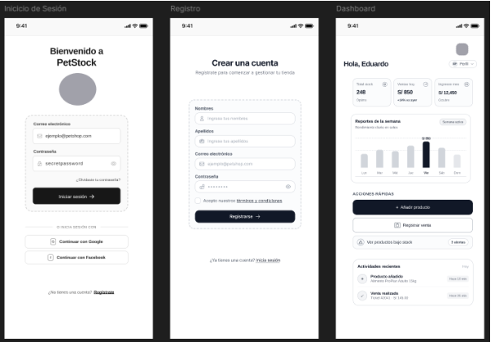

  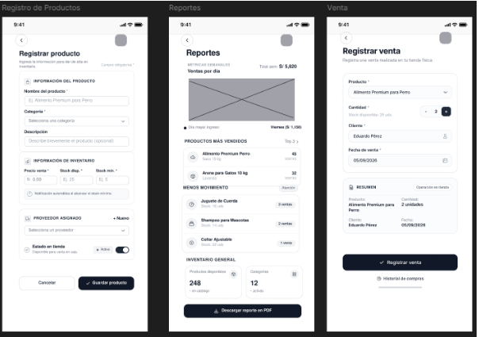

  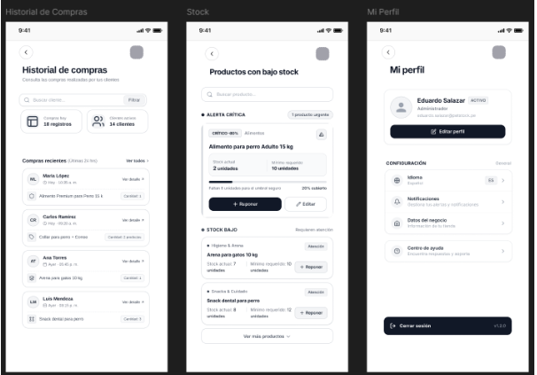

  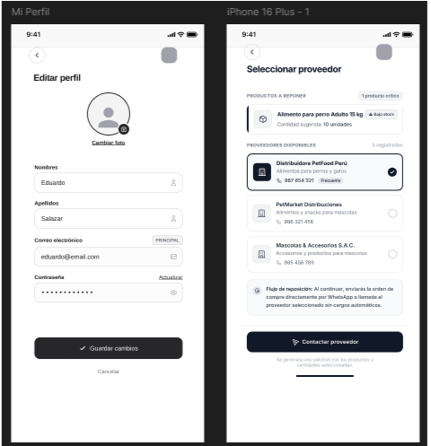

### 4.4.2. Web Applications Wireflow Diagrams

### 4.4.3. Web Applications Mock-ups

### 4.4.4. Web Applications User Flow Diagrams

## 4.5. Web Applications Prototyping

## 4.6. Domain-Driven Software Architecture

### 4.6.1. Design-Level Event Storming

El equipo realizó una sesión de Design-Level EventStorming, partiendo de los hallazgos obtenidos en el Big Picture EventStorming . El objetivo de la sesión fue profundizar el modelado del dominio del problema, identificando con mayor nivel de detalle los Commands, Domain Events y Aggregates asociados a cada proceso de negocio de PetStock.
Como resultado de la sesión, se identificaron 8 Bounded Contexts de negocio a partir de los dominios pivotales detectados: Catalog & Supplier Management, Purchasing & Receiving, Inventory & Stock Monitoring, Sales & Checkout, Customer Relationship Management, Cash Management y Business Analytics & Reporting. A estos se sumó un noveno Bounded Context de soporte técnico, Identity & Access Management, necesario para el control de acceso al sistema.

Durante el refinamiento, se identificaron además policies de integración entre contextos: cuando ocurre el evento MinimumStockThresholdReached en el contexto de Inventory, se habilita el comando PlacePurchaseOrder en Purchasing; cuando ocurre SaleCompleted en Sales & Checkout, se disparan los eventos StockAdjusted en Inventory y SaleLinkedToCustomerProfile en Customer Relationship Management; y cuando ocurre SalesShiftConcluded en Cash Management, se genera el evento CashBalanceSummaryGenerated. 

### 4.6.2. Software Architecture Context Diagram

El diagrama muestra a PetStock como sistema central, rodeado por sus dos actores: el Administrador de tienda, quien gestiona las operaciones diarias del negocio, y el Visitante, quien consulta información a través del Landing Page. Adicionalmente, se identifica la integración con WhatsApp Business API como sistema externo de terceros, utilizado para el envío de solicitudes de reposición a proveedores.

### 4.6.3. Software Architecture Container Diagrams

El diagrama descompone a PetStock en 4 containers independientes, cada uno constituyendo una unidad de despliegue autónoma: el Landing Page, la Web Application, el RESTful API y la Base de Datos. La Web Application se comunica con el API mediante peticiones JSON sobre HTTPS, mientras que el API es responsable de la persistencia de datos y de la integración con el servicio externo de WhatsApp Business API. 

### 4.6.4. Software Architecture Components Diagrams

El diagrama presenta la descomposición interna del container RESTful API en 9 Controllers, cada uno alineado con un Bounded Context identificado en el Design-Level EventStorming (Identity & Access, Catalog & Supplier, Purchasing & Receiving, Inventory & Stock, Sales & Checkout, Cash Management, Customer, Business Analytics y Profile & Configuration). Adicionalmente, se identifican 2 Services de aplicación: el Auth Service, encargado de la validación de credenciales y generación de tokens JWT, y el Notification Service, responsable de la comunicación con WhatsApp Business API. La capa de Repositories, implementada con Entity Framework Core, centraliza el acceso a la Base de Datos para todos los Controllers. 

## 4.7. Software Object-Oriented Design

### 4.7.1. Class Diagrams

## 4.8. Database Design

### 4.8.1. Database Diagram

# Capítulo V: Product Implementation, Validation & Deployment

## 5.1. Software Configuration Management

### 5.1.1. Software Development Environment Configuration

### 5.1.2. Source Code Management

### 5.1.3. Source Code Style Guide & Conventions

### 5.1.4. Software Deployment Configuration

## 5.2. Landing Page, Services & Applications Implementation

### 5.2.1. Sprint 1

#### 5.2.1.1. Sprint Planning 1

#### 5.2.1.2. Aspect Leaders and Collaborators

#### 5.2.1.3. Sprint Backlog 1

#### 5.2.1.4. Development Evidence for Sprint Review

#### 5.2.1.5. Execution Evidence for Sprint Review

#### 5.2.1.6. Services Documentation Evidence for Sprint Review

#### 5.2.1.7. Software Deployment Evidence for Sprint Review

#### 5.2.1.8. Team Collaboration Insights during Sprint

# Conclusiones

# Recomendaciones

# Bibliografia

# Anexo
